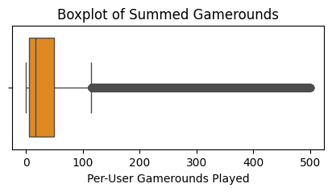
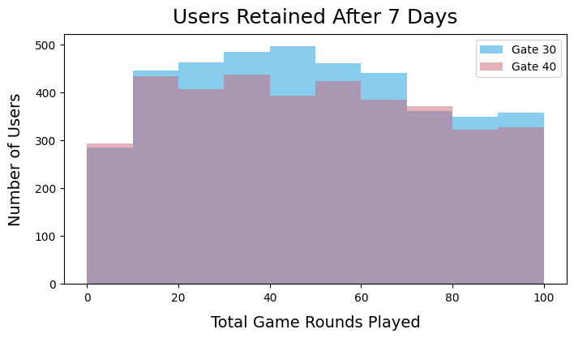

```python
import pandas as pd
import numpy as np
from scipy.stats import ttest_ind
import seaborn as sns
import matplotlib.pyplot as plt
import plotly.express as px
```

## Context
This dataset includes A/B test results of Cookie Cats to examine what happens when the first gate in the game was moved from level 30 to level 40. When a player installed the game, he or she was randomly assigned to either gate_30 or gate_40.

## Content
The data we have is from 90,189 players that installed the game while the AB-test was running. The variables are:

* userid: A unique number that identifies each player.
* version: Whether the player was put in the control group (gate_30 - a gate at level 30) or the group with the moved gate (gate_40 - a gate at level 40).
* sum_gamerounds: the number of game rounds played by the player during the first 14 days after install.
* retention_1: Did the player come back and play 1 day after installing?
* retention_7: Did the player come back and play 7 days after installing?

When a player installed the game, he or she was randomly assigned to either.


```python
d = pd.read_csv('data/GAME-stats.csv')
d.head()
```


<div>
<style scoped>
    .dataframe tbody tr th:only-of-type {
        vertical-align: middle;
    }

    .dataframe tbody tr th {
        vertical-align: top;
    }

    .dataframe thead th {
        text-align: right;
    }
</style>
<table border="1" class="dataframe">
  <thead>
    <tr style="text-align: right;">
      <th></th>
      <th>userid</th>
      <th>version</th>
      <th>sum_gamerounds</th>
      <th>retention_1</th>
      <th>retention_7</th>
    </tr>
  </thead>
  <tbody>
    <tr>
      <th>0</th>
      <td>116</td>
      <td>gate_30</td>
      <td>3</td>
      <td>False</td>
      <td>False</td>
    </tr>
    <tr>
      <th>1</th>
      <td>337</td>
      <td>gate_30</td>
      <td>38</td>
      <td>True</td>
      <td>False</td>
    </tr>
    <tr>
      <th>2</th>
      <td>377</td>
      <td>gate_40</td>
      <td>165</td>
      <td>True</td>
      <td>False</td>
    </tr>
    <tr>
      <th>3</th>
      <td>483</td>
      <td>gate_40</td>
      <td>1</td>
      <td>False</td>
      <td>False</td>
    </tr>
    <tr>
      <th>4</th>
      <td>488</td>
      <td>gate_40</td>
      <td>179</td>
      <td>True</td>
      <td>True</td>
    </tr>
  </tbody>
</table>
</div>


```python
d['sum_gamerounds'].describe()
```


    count    90189.000000
    mean        51.872457
    std        195.050858
    min          0.000000
    25%          5.000000
    50%         16.000000
    75%         51.000000
    max      49854.000000
    Name: sum_gamerounds, dtype: float64


```python
d['sum_gamerounds'].nlargest(10)
```


    57702    49854
    7912      2961
    29417     2640
    43671     2438
    48188     2294
    46344     2251
    87007     2156
    36933     2124
    88328     2063
    6536      2015
    Name: sum_gamerounds, dtype: int64


```python
above_500 = d[d['sum_gamerounds'] > 500]['sum_gamerounds'].count()
below_500 = d[d['sum_gamerounds'] < 500]['sum_gamerounds'].count()

above_500, below_500
```


    (856, 89329)


```python
d.drop(d[d['sum_gamerounds'] > 500].index, inplace=True)
d['sum_gamerounds'].describe()
```


    count    89333.000000
    mean        44.740801
    std         72.476563
    min          0.000000
    25%          5.000000
    50%         16.000000
    75%         49.000000
    max        500.000000
    Name: sum_gamerounds, dtype: float64


```python

plt.figure(figsize=(5, 2))
sns.boxplot(x=d['sum_gamerounds'], color='darkorange').set(
    xlabel='Per-User Gamerounds Played', title='Boxplot of Summed Gamerounds')
plt.show()
```


    

    


```python
Gate30_Day1 = d[d['version'] == 'gate_30']['retention_1'].tolist()
Gate40_Day1 = d[d['version'] == 'gate_40']['retention_1'].tolist()
Gate30_Day7 = d[d['version'] == 'gate_30']['retention_7'].tolist()
Gate40_Day7 = d[d['version'] == 'gate_40']['retention_7'].tolist()
```


```python
# Performing the t-test
t, p = ttest_ind(Gate30_Day1, Gate40_Day1)

# Printing the result

print('Statistical Test for Day 1 Retention')
print(f"t = {t:.3f}")
print(f"p = {p:.3f}")
```

    Statistical Test for Day 1 Retention
    t = 1.789
    p = 0.074
    Statistical Test for Day 1 Retention
    t = 1.789
    p = 0.074


```python
# Performing the t-test
t, p = ttest_ind(Gate30_Day7, Gate40_Day7)

# Printing the result
print('Statistical Test for Day 7 Retention')
print(f"t = {t:.3f}")
print(f"p = {p:.3f}")
```

    Statistical Test for Day 7 Retention
    t = 3.246
    p = 0.001
    Statistical Test for Day 7 Retention
    t = 3.246
    p = 0.001


```python
Gate30 = d[d['version'] == 'gate_30']
Gate40 = d[d['version'] == 'gate_40']
Gate30['retention_1'].value_counts()[True]
Gate30['retention_7'].value_counts()[True]
Gate40['retention_1'].value_counts()[True]
Gate40['retention_7'].value_counts()[True]

stages = ["Downloaded Game", "1 Day Retention", "7 Day Retention"]
g_30 = pd.DataFrame(dict(number=[len(Gate30), 
                                 Gate30['retention_1'].value_counts()[True], 
                                 Gate30['retention_7'].value_counts()[True]], 
                                 stage=stages))
g_30['version'] = 'Gate 30'
g_40 = pd.DataFrame(dict(number=[len(Gate40), 
                                 Gate40['retention_1'].value_counts()[True], 
                                 Gate40['retention_7'].value_counts()[True]], 
                                 stage=stages))
g_40['version'] = 'Gate 40'
df = pd.concat([g_30, g_40], axis=0)
fig = px.funnel(df, x='number', y='stage', color='version', color_discrete_sequence=px.colors.qualitative.Safe,
                title='Funnel Chart of Game Retention by Version', 
                labels={'number':'Number of Players','version':'Game Version','stage':'Retention Point'})
fig.update_layout(title_x=0.5, 
                  font=dict(
                      size=14,
                      )
)
fig.show()
```


```python
# further segment to bulk of players
Gate30_7True = Gate30[(Gate30['retention_7'] == True) & (Gate30['sum_gamerounds'] <= 100)]
Gate40_7True = Gate40[(Gate40['retention_7'] == True) & (Gate40['sum_gamerounds'] <= 100)]

# Plotting the data
plt.figure(figsize=(8, 4))
plt.hist(Gate30_7True['sum_gamerounds'], alpha=1, label='Gate 30', color='#88CCEE')
plt.hist(Gate40_7True['sum_gamerounds'], alpha=0.5, label='Gate 40', color='#CC6677')
plt.legend(loc='upper right')
plt.title('Users Retained After 7 Days', fontsize=18, pad=10)
plt.xlabel('Total Game Rounds Played', fontsize=14, labelpad=10)
plt.ylabel('Number of Users', fontsize=14, labelpad=10)
plt.show()
```


    

    

