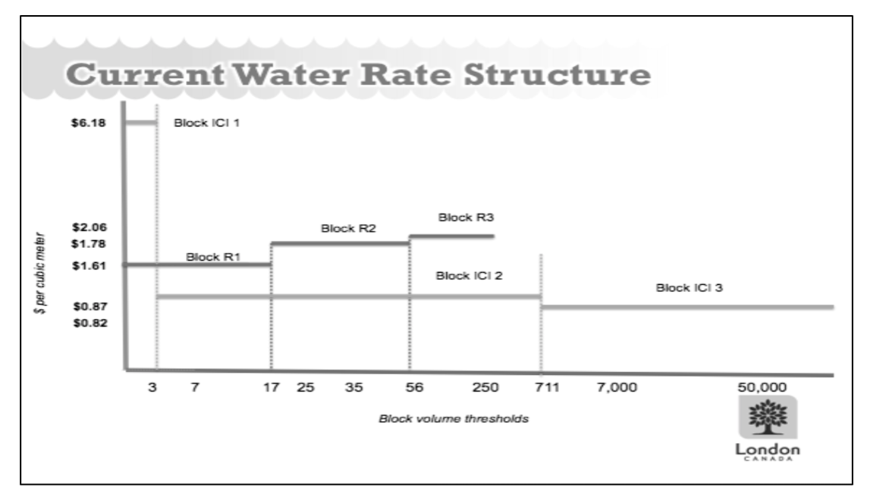
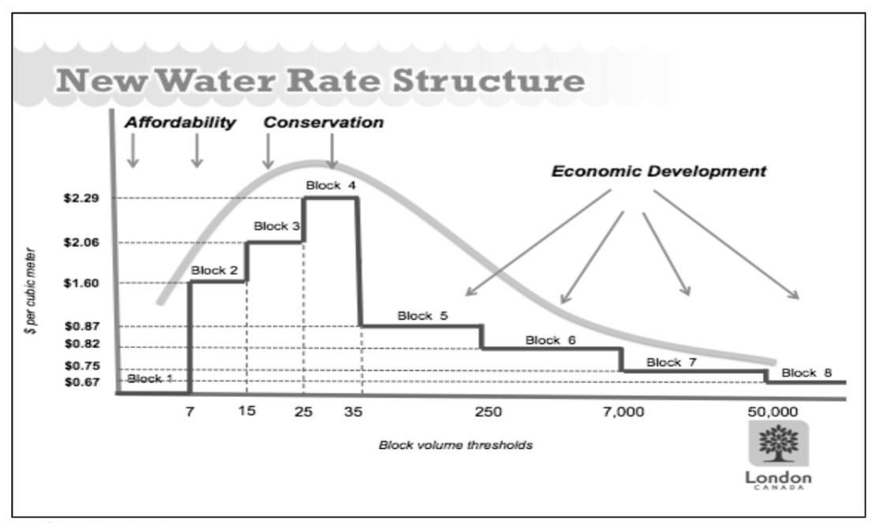
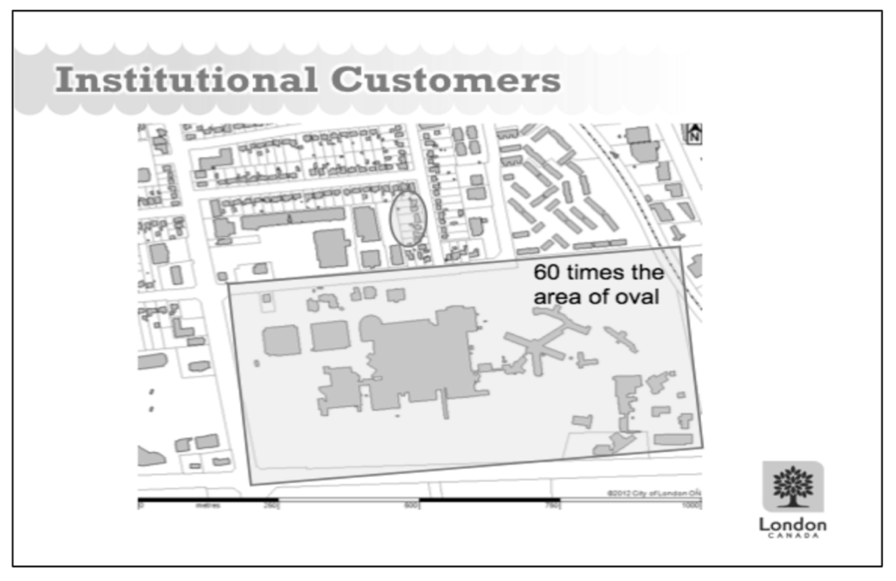

## Problem at Hand

The water management system for London, Ontario has gone through
multiple administrative and regulatory changes over the last few
decades, causing increases in expenses for purely bureaucratic purposes
-- though in the case of the regulatory changes these expenses are
welcomed for public safety. These changes, though, are in addition to
the natural expenses that arise with a city that has seen a drastic
increase in growth over the years and has aging pipelines that need to
be planned for replacement in the coming decades. Add that to a pricing
structure that hasn't been reviewed in some time and London Water's
billing method is due for some adjustments. The business is not
sustainable as is; the pricing structure needs to be adjusted to ensure
future financial stability that accounts for needed upgrades and
expansions on the water system, while also encouraging reduced water
usage both for environmental reasons and to help reduce the strain on
the water system.

However, it is not as easy as simply increasing rates across the board.
There are three main categories of water use: water intake, wastewater
processing, and stormwater management. The first, and least expensive to
manage, is easy to account for using water meters. However, there is
nuance to the last two -- which also happen to be the most expensive to
manage. Wastewater processing is not as easy as "water in equals water
out". Rather, there are multiple businesses, providing economic value to
the city, that use water in their product. These include companies like
breweries, so water intake is vastly higher than their wastewater
production. Additionally, there are concerns around the equitability of
the stormwater billing structure due to the limitations of the current
system.

## Analysis Summary

The existing water rate structure, shown in Exhibit 1, differentiates
rates between residential customers (R1-R3) and business customers
(industrial, commercial, and institutional -- ICI1-ICI3). Using this
payment structure, with the exception of ICI1 which is an extreme
outlier, businesses that are using the same amount of water as
residential customers are paying less per cubic meter of water
non-business customers. While the likely intent of reduced rates for
businesses is to support industries that rely on water for their final
product, such as breweries, a business using the same amount of water as
a residential customer is most likely not using water in their final
product. As such, residential customers are directly subsidizing the
water expenses for businesses in the area.

Exhibit 2, though, shows the proposed new water rate which does not
differentiate between business and residential customers. Rather, the
new rate breaks metered water usage into eight groups with unique rates
intended to meet particular goals based on the amount of water being
used. The first two groups, Block 1 and 2, are for customers using the
least amount of water and are intended to provide consumers with a
built-in discount for reducing their water consumption. From there,
Block 3 and 4 increase rates to account for the added strain on the
water system by residential and business customers for whom water intake
is assumed to be similar to wastewater output. Starting with group 5 and
beyond, the cubic meter rate reduces and continues to reduce to both
account for and encourage the development of businesses that use water
for their sales product.

For the residential side, customers who are on the higher end of water
usage will see an increase in their water expenses. However, that is
intentional and meant to encourage a reduction in water use over time.
As seen in Exhibit 3, the prospective of metered residential water usage
rates, under the new billing system the average residential customer
would be included in Block 3 for 2011-2013, while the former system had
the average customer in RS1 for 2011 and 2012, then RS2 for 2013. With
the new billing system in place, the total metered fees for residential
customers would increase, bringing in an additional 6-8 million in
revenue provided water usage doesn't change.

## Recommended Next Steps

By adjusting the metered water rates to no longer differentiate between
residential and business customers, London Water will be able to both
bring in additional revenue and provide a more equitable experience to
its customer base while still adjusting for business enterprises that
use water as part of their final product. However, while a new customer
billing layout is being introduced alongside the new metered fee system,
the flat rate fees are as yet unchanged. The new billing system for
metered charges directly addresses water intake and wastewater
processing, however the inequity in expenses related to stormwater
processing still needs to be addressed. This is the next step that must
be taken in the review of London Water's billing system.

Under the current system, as seen in exhibit 4, the smallest cutoff for
stormwater charges is 0.4 hectares, or 1 acre. As London, Ontario is a
fairly dense urban area, the average residential lot is well below that
cutoff. For example, exhibit 5 demonstrates how a single institutional
business customer uses over 60 times the land mass of 8 residential
customers (shown in the circled oval), yet the group of residential
customers pay more the same amount for stormwater runoff than the
institutional customer. In full transparency, the business customers are
underpaying for their stormwater fees. By adding nuance to the billing
structure to account for variable lot sizes, London Water will be able
to build more equity into their billing structure while also recouping
lost expenses for processing stormwater runoff for businesses that use
larger areas of land. This is the next London Water needs to take in
building a sustainable billing system.

### Exhibit 1 -- London Water's Current Water Rate Structure

### {width="6.5in" height="3.6951388888888888in"}

### 

### Exhibit 2 -- London Water's New Water Rate Structure

{width="6.5in"
height="3.839583333333333in"}

### 

### 

### Exhibit 3 -- Prospective of Metered Residential Water Usage Rates

  -----------------------------------------------------------------------------------------------------
                        **2011**                    **2012**                   **2013**    
  ------------------- ------------- ------------- ------------- ------------ ------------- ------------
  Total Residential    18,527,265                  18,488,769                 23,584,012   
  Water Usage for the     m^3^                        m^3^                       m^3^      
  Year                                                                                     

  Total Number of        99,641                      100,801                    102,421    
  Residential                                                                              
  Customers                                                                                

  Average Monthly      15.50 m^3^                  15.28 m^3^                 19.19 m^3^   
  Usage per                                                                                
  Residential                                                                              
  Customer                                                                                 

  Average Water Rate:   *\$ 2.06*   \$ 38,166,166   *\$ 2.06*        \$        *\$ 2.06*        \$
  New                                                            38,086,864                 48,583,065

  Average Water Rate:   *\$ 1.61*   \$ 29,828,897   *\$ 1.61*        \$        *\$ 1.78*        \$
  Old                                                            29,766,918                 41,979,541

  **Revenue               **\$                        **\$                       **\$      
  Increase**           8,337,269**                 8,319,946**                6,603,523**  
  -----------------------------------------------------------------------------------------------------

### 

### Exhibit 4 -- Stormwater Processing Fees

  ------------------------------------------------------------------------
  **Customer Type**                              **Rate**       **Unit**
  ------------------------------------------- --------------- ------------
  Residential \< 0.4 hectares                    \$ 13.78       monthly

  Institutional \< 0.4 hectares                  \$ 13.66       monthly

  Commercial/Industrial \< 0.4 hectares          \$ 14.78       monthly

  Commercial/Institutional/Residential \> 0.4    \$ 75.12     per hectare
  hectares                                                    

  Industrial \> 0.4 hectares                     \$ 112.68    per hectare
  ------------------------------------------------------------------------

\* 0.4 hectares \~ 1 acre

### Exhibit 5 -- Institutional vs Residential Land Area Use

{width="4.916083770778653in"
height="3.1923031496062992in"}
