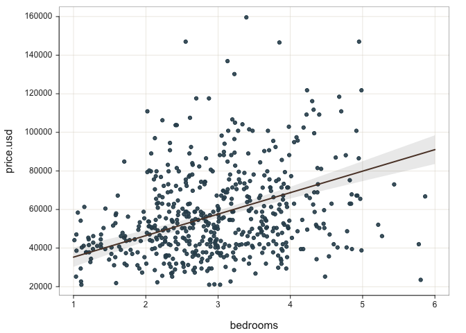
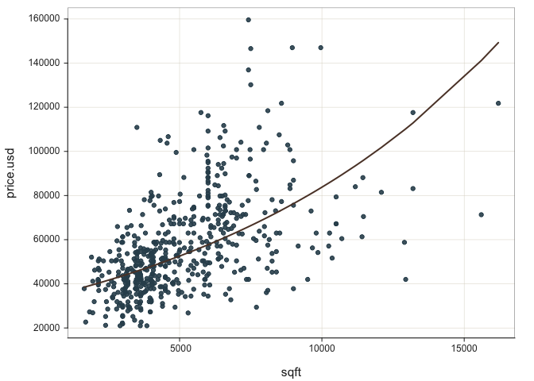
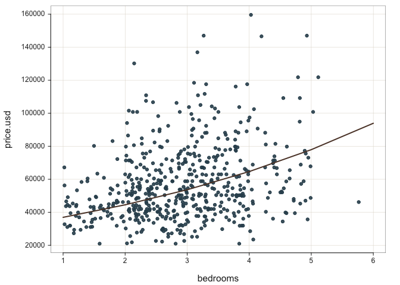

## Introduction

For this report, I’ll be working with the *[Housing Price Prediction
dataset](https://www.kaggle.com/datasets/harishkumardatalab/housing-price-prediction)*,
found on *[Kaggle](https://www.kaggle.com/)*. Each sample in the dataset
represents a single house in an unnamed sqft of India. As shown below,
there are no missing values within the dataset and we have a mix of
categorical and continuous variables. Each sample is numerically labeled
by its row number.

To make the calculations easier to understand for a US audience, we’re
going to transform the price (currently in Rupees) to USD. The current
exchange rate as of this report is 0.012 USD for every 1 rupee, so that
will be the calculation used. Additionally, one of the columns (area) is
in square feet, so we will rename that column for clarity.

<table class="table" style="margin-left: auto; margin-right: auto;">
<caption>
Dataset Head
</caption>
<thead>
<tr>
<th style="text-align:left;">
</th>
<th style="text-align:center;">
1
</th>
<th style="text-align:center;">
2
</th>
<th style="text-align:center;">
3
</th>
<th style="text-align:center;">
4
</th>
<th style="text-align:center;">
5
</th>
<th style="text-align:center;">
6
</th>
</tr>
</thead>
<tbody>
<tr>
<td style="text-align:left;">
price
</td>
<td style="text-align:center;">
13300000
</td>
<td style="text-align:center;">
12250000
</td>
<td style="text-align:center;">
12250000
</td>
<td style="text-align:center;">
12215000
</td>
<td style="text-align:center;">
11410000
</td>
<td style="text-align:center;">
10850000
</td>
</tr>
<tr>
<td style="text-align:left;">
sqft
</td>
<td style="text-align:center;">
7420
</td>
<td style="text-align:center;">
8960
</td>
<td style="text-align:center;">
9960
</td>
<td style="text-align:center;">
7500
</td>
<td style="text-align:center;">
7420
</td>
<td style="text-align:center;">
7500
</td>
</tr>
<tr>
<td style="text-align:left;">
bedrooms
</td>
<td style="text-align:center;">
4
</td>
<td style="text-align:center;">
4
</td>
<td style="text-align:center;">
3
</td>
<td style="text-align:center;">
4
</td>
<td style="text-align:center;">
4
</td>
<td style="text-align:center;">
3
</td>
</tr>
<tr>
<td style="text-align:left;">
bathrooms
</td>
<td style="text-align:center;">
2
</td>
<td style="text-align:center;">
4
</td>
<td style="text-align:center;">
2
</td>
<td style="text-align:center;">
2
</td>
<td style="text-align:center;">
1
</td>
<td style="text-align:center;">
3
</td>
</tr>
<tr>
<td style="text-align:left;">
stories
</td>
<td style="text-align:center;">
3
</td>
<td style="text-align:center;">
4
</td>
<td style="text-align:center;">
2
</td>
<td style="text-align:center;">
2
</td>
<td style="text-align:center;">
2
</td>
<td style="text-align:center;">
1
</td>
</tr>
<tr>
<td style="text-align:left;">
mainroad
</td>
<td style="text-align:center;">
yes
</td>
<td style="text-align:center;">
yes
</td>
<td style="text-align:center;">
yes
</td>
<td style="text-align:center;">
yes
</td>
<td style="text-align:center;">
yes
</td>
<td style="text-align:center;">
yes
</td>
</tr>
<tr>
<td style="text-align:left;">
guestroom
</td>
<td style="text-align:center;">
no
</td>
<td style="text-align:center;">
no
</td>
<td style="text-align:center;">
no
</td>
<td style="text-align:center;">
no
</td>
<td style="text-align:center;">
yes
</td>
<td style="text-align:center;">
no
</td>
</tr>
<tr>
<td style="text-align:left;">
basement
</td>
<td style="text-align:center;">
no
</td>
<td style="text-align:center;">
no
</td>
<td style="text-align:center;">
yes
</td>
<td style="text-align:center;">
yes
</td>
<td style="text-align:center;">
yes
</td>
<td style="text-align:center;">
yes
</td>
</tr>
<tr>
<td style="text-align:left;">
hotwaterheating
</td>
<td style="text-align:center;">
no
</td>
<td style="text-align:center;">
no
</td>
<td style="text-align:center;">
no
</td>
<td style="text-align:center;">
no
</td>
<td style="text-align:center;">
no
</td>
<td style="text-align:center;">
no
</td>
</tr>
<tr>
<td style="text-align:left;">
airconditioning
</td>
<td style="text-align:center;">
yes
</td>
<td style="text-align:center;">
yes
</td>
<td style="text-align:center;">
no
</td>
<td style="text-align:center;">
yes
</td>
<td style="text-align:center;">
yes
</td>
<td style="text-align:center;">
yes
</td>
</tr>
<tr>
<td style="text-align:left;">
parking
</td>
<td style="text-align:center;">
2
</td>
<td style="text-align:center;">
3
</td>
<td style="text-align:center;">
2
</td>
<td style="text-align:center;">
3
</td>
<td style="text-align:center;">
2
</td>
<td style="text-align:center;">
2
</td>
</tr>
<tr>
<td style="text-align:left;">
prefarea
</td>
<td style="text-align:center;">
yes
</td>
<td style="text-align:center;">
no
</td>
<td style="text-align:center;">
yes
</td>
<td style="text-align:center;">
yes
</td>
<td style="text-align:center;">
no
</td>
<td style="text-align:center;">
yes
</td>
</tr>
<tr>
<td style="text-align:left;">
furnishingstatus
</td>
<td style="text-align:center;">
furnished
</td>
<td style="text-align:center;">
furnished
</td>
<td style="text-align:center;">
semi-furnished
</td>
<td style="text-align:center;">
furnished
</td>
<td style="text-align:center;">
furnished
</td>
<td style="text-align:center;">
semi-furnished
</td>
</tr>
<tr>
<td style="text-align:left;">
price.usd
</td>
<td style="text-align:center;">
159600
</td>
<td style="text-align:center;">
147000
</td>
<td style="text-align:center;">
147000
</td>
<td style="text-align:center;">
146580
</td>
<td style="text-align:center;">
136920
</td>
<td style="text-align:center;">
130200
</td>
</tr>
</tbody>
</table>

Each variable represents the following house features:

**Integers**

-   *price*: The price of the house in rupees.
-   *price.usd*: The price of the house in USD.
-   *sqft*: The total sqft of the house in square feet.
-   *bedrooms*: The number of bedrooms in the house.
-   *bathrooms*: The number of bathrooms in the house.
-   *stories*: The number of stories in the house.
-   *parking*: The number of parking spaces available within the house.

**Categorical**

-   *mainroad*: Whether the house is connected to the main road
    (Yes/No).
-   *guestroom*: Whether the house has a guest room (Yes/No).
-   *basement*: Whether the house has a basement (Yes/No).
-   *hotwaterheating*: Whether the house has a hot water heating system
    (Yes/No).
-   *airconditioning*: Whether the house has an air conditioning system
    (Yes/No).
-   *prefarea*: Whether the house is located in a preferred sqft
    (Yes/No).
-   *furnishingstatus*: The furnishing status of the house (Fully
    Furnished, Semi-Furnished, Unfurnished).

### Variables of Interest

For this report, we will work with a single target variable: price.usd.

Since the full dataset has a total of 13 variables (including our
targets), we will proactively reduce the number of variables for the
sake of simplicity in this project. With that, the variables we will
include (including our target) are price.usd, sqft, bedrooms, bathrooms,
stories, parking, basement, airconditioning, and prefarea.

## Analysis

The intention of our analysis is to generate a model for predicting the
price (in USD) of a given home. The target variable is *price.usd* and
the predictor variables are:

-   sqft (continuous)
-   bedrooms (continuous)
-   bathrooms (continuous)
-   stories (continuous)
-   basementyes (binary dummy variable)
-   airconditioningyes (binary dummy variable)
-   parking (continuous)
-   prefareayes (binary dummy variable)

The dummy variables for basement, airconditioning, and prefarea were
automatically generated using the lessR regression analysis instruction;
the “no” selections were dropped so the variables were updated to
include “yes” at the end. A 0 in these fields would indicate “no” while
a 1 would indicate “yes” for these variables.

### Scatterplot

As we begin our work, we’ll want to review some basic information on the
regression analysis to ensure we’re working with predictors that
correlate to the target variable, but not to each other.

The first step in that process is to review the scatterplots for each
predictor alongside the target (price.usd). As an example, we’ll
generate two plots for two predictors: sqft found in and bedrooms. The
first set of plots, shown in @ref(fig:lm.scatter), uses the best-fitting
least squares line while the other set of plots, shown in
@ref(fig:exp.scatter), uses the best-fitting exponential curve.

Sqft Feet and Bedrooms Scatterplots, Least Squares

Sqft and Bedrooms Scatterplots, Exponential Curve

Each plot does appear to fit the data, though the exponential curve has
slightly better metrics with R2 when reviewing the variables
on an individual basis:

*Area*:

-   Least Squares Line: Fit: MSE = 359,716,100; R2 = 0.287
-   Exponential Curve: MSE = 0.098; R2 = 0.295

*Bedrooms*:

-   Least Squares Line: MSE = 436,925,507; R2 = 0.134
-   Exponential Curve: MSE = 0.120; R2 = 0.137

With that, for the sake of this project, we’re going to conduct a
logistic regression for the target variable prior to continuing our
analysis. To do so, we’re making a logarithmic transformation on the
target variable, and will rerun our regression analysis using the
transformed variable.

### Correlation Matrix

At this point, we’re going to review our Correlation Coefficient output
from the regression analysis.

<table class="table" style="margin-left: auto; margin-right: auto;">
<caption>
Correlation Coefficients
</caption>
<thead>
<tr>
<th style="text-align:left;">
</th>
<th style="text-align:center;">
price.usd.log
</th>
<th style="text-align:center;">
sqft
</th>
<th style="text-align:center;">
bedrooms
</th>
<th style="text-align:center;">
bathrooms
</th>
<th style="text-align:center;">
stories
</th>
<th style="text-align:center;">
basementyes
</th>
<th style="text-align:center;">
airconditioningyes
</th>
<th style="text-align:center;">
parking
</th>
<th style="text-align:center;">
prefareayes
</th>
</tr>
</thead>
<tbody>
<tr>
<td style="text-align:left;">
price.usd.log
</td>
<td style="text-align:center;">
1.00
</td>
<td style="text-align:center;">
0.54
</td>
<td style="text-align:center;">
0.37
</td>
<td style="text-align:center;">
0.49
</td>
<td style="text-align:center;">
0.42
</td>
<td style="text-align:center;">
0.22
</td>
<td style="text-align:center;">
0.46
</td>
<td style="text-align:center;">
0.37
</td>
<td style="text-align:center;">
0.34
</td>
</tr>
<tr>
<td style="text-align:left;">
sqft
</td>
<td style="text-align:center;">
0.54
</td>
<td style="text-align:center;">
1.00
</td>
<td style="text-align:center;">
0.15
</td>
<td style="text-align:center;">
0.19
</td>
<td style="text-align:center;">
0.08
</td>
<td style="text-align:center;">
0.05
</td>
<td style="text-align:center;">
0.22
</td>
<td style="text-align:center;">
0.35
</td>
<td style="text-align:center;">
0.23
</td>
</tr>
<tr>
<td style="text-align:left;">
bedrooms
</td>
<td style="text-align:center;">
0.37
</td>
<td style="text-align:center;">
0.15
</td>
<td style="text-align:center;">
1.00
</td>
<td style="text-align:center;">
0.37
</td>
<td style="text-align:center;">
0.41
</td>
<td style="text-align:center;">
0.10
</td>
<td style="text-align:center;">
0.16
</td>
<td style="text-align:center;">
0.14
</td>
<td style="text-align:center;">
0.08
</td>
</tr>
<tr>
<td style="text-align:left;">
bathrooms
</td>
<td style="text-align:center;">
0.49
</td>
<td style="text-align:center;">
0.19
</td>
<td style="text-align:center;">
0.37
</td>
<td style="text-align:center;">
1.00
</td>
<td style="text-align:center;">
0.33
</td>
<td style="text-align:center;">
0.10
</td>
<td style="text-align:center;">
0.19
</td>
<td style="text-align:center;">
0.18
</td>
<td style="text-align:center;">
0.06
</td>
</tr>
<tr>
<td style="text-align:left;">
stories
</td>
<td style="text-align:center;">
0.42
</td>
<td style="text-align:center;">
0.08
</td>
<td style="text-align:center;">
0.41
</td>
<td style="text-align:center;">
0.33
</td>
<td style="text-align:center;">
1.00
</td>
<td style="text-align:center;">
-0.17
</td>
<td style="text-align:center;">
0.29
</td>
<td style="text-align:center;">
0.05
</td>
<td style="text-align:center;">
0.04
</td>
</tr>
<tr>
<td style="text-align:left;">
basementyes
</td>
<td style="text-align:center;">
0.22
</td>
<td style="text-align:center;">
0.05
</td>
<td style="text-align:center;">
0.10
</td>
<td style="text-align:center;">
0.10
</td>
<td style="text-align:center;">
-0.17
</td>
<td style="text-align:center;">
1.00
</td>
<td style="text-align:center;">
0.05
</td>
<td style="text-align:center;">
0.05
</td>
<td style="text-align:center;">
0.23
</td>
</tr>
<tr>
<td style="text-align:left;">
airconditioningyes
</td>
<td style="text-align:center;">
0.46
</td>
<td style="text-align:center;">
0.22
</td>
<td style="text-align:center;">
0.16
</td>
<td style="text-align:center;">
0.19
</td>
<td style="text-align:center;">
0.29
</td>
<td style="text-align:center;">
0.05
</td>
<td style="text-align:center;">
1.00
</td>
<td style="text-align:center;">
0.16
</td>
<td style="text-align:center;">
0.12
</td>
</tr>
<tr>
<td style="text-align:left;">
parking
</td>
<td style="text-align:center;">
0.37
</td>
<td style="text-align:center;">
0.35
</td>
<td style="text-align:center;">
0.14
</td>
<td style="text-align:center;">
0.18
</td>
<td style="text-align:center;">
0.05
</td>
<td style="text-align:center;">
0.05
</td>
<td style="text-align:center;">
0.16
</td>
<td style="text-align:center;">
1.00
</td>
<td style="text-align:center;">
0.09
</td>
</tr>
<tr>
<td style="text-align:left;">
prefareayes
</td>
<td style="text-align:center;">
0.34
</td>
<td style="text-align:center;">
0.23
</td>
<td style="text-align:center;">
0.08
</td>
<td style="text-align:center;">
0.06
</td>
<td style="text-align:center;">
0.04
</td>
<td style="text-align:center;">
0.23
</td>
<td style="text-align:center;">
0.12
</td>
<td style="text-align:center;">
0.09
</td>
<td style="text-align:center;">
1.00
</td>
</tr>
</tbody>
</table>

From the information provided, we can determine that the predictor
variables do relate to the target variable, to differing degrees. Sqft
(the house’s area), bathrooms (count of bathrooms in the house),
airconditioningyes (if the house has air conditioning) and stories (the
number of floors) have the highest correlation scores with reference to
our target (price.usd). The lowest score is basementyes (if the house
has a basement), at 0.22.

Collinearity between predictor variables does not appear to be a problem
in this dataset given that the highest correlation coefficient between
two predictor variables is 0.41 with most of the scores well below that
threshold.

As such, based on this cursory review, to predict the price.usd of a
given house the final model would likely include sqft, bathrooms,
airconditioningyesm and stories. Some of the other variables be included
as well, however the actual selection will be dependent on how the
interactions between variables are adjusted with further model
adjustments.

### Estimated Model

The estimates from our final model are included in the table below. It
is important to note that while sqft shows as having a 0.000 estimated
slope coefficient to three decimal points, the actual slope coefficient
is 0.000056. Although this may seem small, in the scale of our analysis
it is actually quite impactful (as will be shown in our hypothesis
test).

<table class="table" style="margin-left: auto; margin-right: auto;">
<caption>
Initial Model Estimates
</caption>
<thead>
<tr>
<th style="text-align:left;">
</th>
<th style="text-align:center;">
Estimate
</th>
<th style="text-align:center;">
Std Err
</th>
<th style="text-align:center;">
t-value
</th>
<th style="text-align:center;">
p-value
</th>
<th style="text-align:center;">
Lower 95
</th>
<th style="text-align:center;">
Upper 95
</th>
</tr>
</thead>
<tbody>
<tr>
<td style="text-align:left;">
(Intercept)
</td>
<td style="text-align:center;">
9.956
</td>
<td style="text-align:center;">
0.041
</td>
<td style="text-align:center;">
241.399
</td>
<td style="text-align:center;">
0.000
</td>
<td style="text-align:center;">
9.875
</td>
<td style="text-align:center;">
10.037
</td>
</tr>
<tr>
<td style="text-align:left;">
sqft
</td>
<td style="text-align:center;">
0.000
</td>
<td style="text-align:center;">
0.000
</td>
<td style="text-align:center;">
11.929
</td>
<td style="text-align:center;">
0.000
</td>
<td style="text-align:center;">
0.000
</td>
<td style="text-align:center;">
0.000
</td>
</tr>
<tr>
<td style="text-align:left;">
bedrooms
</td>
<td style="text-align:center;">
0.018
</td>
<td style="text-align:center;">
0.014
</td>
<td style="text-align:center;">
1.265
</td>
<td style="text-align:center;">
0.206
</td>
<td style="text-align:center;">
-0.010
</td>
<td style="text-align:center;">
0.046
</td>
</tr>
<tr>
<td style="text-align:left;">
bathrooms
</td>
<td style="text-align:center;">
0.188
</td>
<td style="text-align:center;">
0.020
</td>
<td style="text-align:center;">
9.303
</td>
<td style="text-align:center;">
0.000
</td>
<td style="text-align:center;">
0.149
</td>
<td style="text-align:center;">
0.228
</td>
</tr>
<tr>
<td style="text-align:left;">
stories
</td>
<td style="text-align:center;">
0.102
</td>
<td style="text-align:center;">
0.012
</td>
<td style="text-align:center;">
8.322
</td>
<td style="text-align:center;">
0.000
</td>
<td style="text-align:center;">
0.078
</td>
<td style="text-align:center;">
0.126
</td>
</tr>
<tr>
<td style="text-align:left;">
basementyes
</td>
<td style="text-align:center;">
0.116
</td>
<td style="text-align:center;">
0.020
</td>
<td style="text-align:center;">
5.770
</td>
<td style="text-align:center;">
0.000
</td>
<td style="text-align:center;">
0.076
</td>
<td style="text-align:center;">
0.155
</td>
</tr>
<tr>
<td style="text-align:left;">
airconditioningyes
</td>
<td style="text-align:center;">
0.168
</td>
<td style="text-align:center;">
0.022
</td>
<td style="text-align:center;">
7.605
</td>
<td style="text-align:center;">
0.000
</td>
<td style="text-align:center;">
0.125
</td>
<td style="text-align:center;">
0.212
</td>
</tr>
<tr>
<td style="text-align:left;">
parking
</td>
<td style="text-align:center;">
0.054
</td>
<td style="text-align:center;">
0.011
</td>
<td style="text-align:center;">
4.835
</td>
<td style="text-align:center;">
0.000
</td>
<td style="text-align:center;">
0.032
</td>
<td style="text-align:center;">
0.077
</td>
</tr>
<tr>
<td style="text-align:left;">
prefareayes
</td>
<td style="text-align:center;">
0.158
</td>
<td style="text-align:center;">
0.022
</td>
<td style="text-align:center;">
7.144
</td>
<td style="text-align:center;">
0.000
</td>
<td style="text-align:center;">
0.115
</td>
<td style="text-align:center;">
0.202
</td>
</tr>
</tbody>
</table>

From the information shown above, we can generate an the following
regression model. For the model, we are using 6 decimal points rather
than 3, to better illustrate the model.

$$
 \begin{split}
 \begin{aligned}
     log \\ \hat{y} = 9.933829   &+ 0.000056 \cdot x\_{sqft} \\ 
     &+ 0.026280 \cdot x\_{bedrooms} \\
     &+ 0.172082 \cdot x\_{bathrooms} \\ 
     &+ 0.104458 \cdot x\_{stories} \\ 
     &+ 0.126682 \cdot x\_{basementyes} \\ 
     &+ 0.168142 \cdot x\_{airconditioningyes} \\ 
     &+ 0.060303 \cdot x\_{parking} \\ 
     &+ 0.139599 \cdot x\_{prefareayes} \\
  \end{aligned}
  \end{split}
$$
This model uses the intercept and the sample slope coefficients for each
predictor variable, which will be multiplied by provided values to
generate the natural logarithm of the estimated price.usd. To get an
actual price.usd prediction, we will need to take the result and provide
its inverse (the exponential function). Each sample slope coefficient is
an indication of how much the (natural log) price.usd of a house
approximately changes within our sample data with a one-unit change in
the specified predictor variable, when the other predictor variables
held constant (i.e. no change in their values).

As an example, the sample slope coefficient of 0.000056 for
*b**s**q**f**t* indicates, *for these sample data only when
all other variables are held constant*, every unit (square foot)
increase in sqft produces, on average, a 0.000056 increase in the
natural log of the house’s price in USD.

To provide an example of how the estimated model applies to an actual
house, we’ll work with the second row in the dataset, house2.
That house has the following details:

<table class="table" style="margin-left: auto; margin-right: auto;">
<caption>
Second row of dataset
</caption>
<thead>
<tr>
<th style="text-align:left;">
</th>
<th style="text-align:center;">
price.usd
</th>
<th style="text-align:center;">
price.usd.log
</th>
<th style="text-align:center;">
sqft
</th>
<th style="text-align:center;">
bedrooms
</th>
<th style="text-align:center;">
bathrooms
</th>
<th style="text-align:center;">
stories
</th>
<th style="text-align:center;">
basement
</th>
<th style="text-align:center;">
airconditioning
</th>
<th style="text-align:center;">
parking
</th>
<th style="text-align:center;">
prefarea
</th>
</tr>
</thead>
<tbody>
<tr>
<td style="text-align:left;">
2
</td>
<td style="text-align:center;">
147000
</td>
<td style="text-align:center;">
11.89819
</td>
<td style="text-align:center;">
8960
</td>
<td style="text-align:center;">
4
</td>
<td style="text-align:center;">
4
</td>
<td style="text-align:center;">
4
</td>
<td style="text-align:center;">
no
</td>
<td style="text-align:center;">
yes
</td>
<td style="text-align:center;">
3
</td>
<td style="text-align:center;">
no
</td>
</tr>
</tbody>
</table>

The manually calculated estimation for this house’s price.usd is:
$$
 \begin{split}
 \begin{aligned}
     log \\ \hat{y} = 14.356678  &+ 0.000056 \cdot 8960 \\ 
     &+ 0.026280 \cdot 4 \\
     &+ 0.172082 \cdot 4 \\ 
     &+ 0.104458 \cdot 4 \\ 
     &+ 0.126682 \cdot 0 \\ 
     &+ 0.168142 \cdot 1 \\ 
     &+ 0.060303 \cdot 3 \\ 
     &+ 0.139599 \cdot 0\\
  \end{aligned}
  \end{split}
$$

The result of this calculation is *l**o**g* *ŷ* = 11.99592. When we take
the inverse of the log for that value, the estimated house price in USD
is approximately 162,092. Do note that the log of price.USD provided in
the readout for the house is more accurate, as it is not rounded.
However, we’re including these calculations as representations of the
process.

Since this is just an estimate, there will of course be a residual
(difference between the fitted value and the actual value). The residual
can be calculated with the formula
*e**i* = *Y**i* − *Ŷ* = 147000 − 162092 =  − 15092,
which tells us that when given the predictor variable values for
house2, our model generates a fitted value that is 15,092
more than the actual value for this house in USD.

### Hypothesis Test

The core of the hypothesis test is to determine if there is a relation
between each predictor variable and our target variable (price.usd).
What’s being tested is the null hypothesis, that *β**i* = 0
and therefore in the population, a change in predictori for a
house *does not* lead to consistent increases or decreases in the price
of a house, when all other predictor variables are held constant.

The alternative to the null hypothes is *β**i* ≠ 0 and
therefore in the population, a change in predictori for a
house *does* lead to consistent increases or decreases in the price of a
house, when all other predictor variables are held constant.

Two key values in this test are the *t-value* and the *p-value*. The
*t-value* is the number of estimated standard errors *β**i*
is from the null hypothesized slope (0). The *p-value* is the
probability of obtaining an estimated slope coefficient
*β**i* with a given *t-value*; the cutoff for the p-value is
generally *α* = 0.05 so if the p-value is above that cutoff we *fail to
reject* the null hypothesis.

For this, we will provide examples using two of the predictor variables:
sqft and bedrooms. We will provide the null hypothesis for each, the
alternative, and calculations that lead to *reject* or *failing to
reject* the null hypothesis.

#### Hypothesis Test for Area

-   Null hypothesis: *β**s**q**f**t* = 0
-   Alternative: *β**s**q**f**t* ≠ 0
-   t-value:
    $t\_{sqft} = \frac{b\_{sqft} - 0}{s\_{sqft}} = \frac{0.000056 - 0}{0.000005} = 11.2$
-   p-value: 0.000 to three decimal points

**Decision**: If the null hypothesis that *β**s**q**f**t* = 0
is true, obtaining a value for bsqft more than eleven
standard errors from 0 is very unlikely, with a probability of 0.000 to
three decimal digits. As such, we *reject* the null hypothesis for
*β**s**q**f**t*.

**Executive Summary**: Our calculations from the sample dataset indicate
there is a reasonable relationship between the sqft of a house and the
price of the house. When the sqft of a house increases, with all other
predictor variables unchanged, the price of the house will generally
also increase (this can be applied to either the USD or rupee value for
the home).

#### Hypothesis Test for Bedrooms

-   Null hypothesis: *β**b**e**d**r**o**o**m**s* = 0
-   Alternative: *β**b**e**d**r**o**o**m**s* ≠ 0
-   t-value:
    $t\_{bedrooms} = \frac{b\_{bedrooms} - 0}{s\_{bedrooms}} = \frac{0.026280 - 0}{0.014961} = 1.757$
-   p-value: 0.080 to three decimal points

**Decision**: If the null hypothesis that
*β**b**e**d**r**o**o**m**s* = 0 is true, obtaining a value
for bsqft less than two standard errors from 0 is highly
likely, with a probability of 0.080 to three decimal digits. As such, we
*fail to reject* the null hypothesis for
*β**b**e**d**r**o**o**m**s*.

**Executive Summary**: Our calculations from the sample dataset indicate
there is not a reasonable relationship between the number of bedrooms
listed for a house and the price of the house. When the number of
bedrooms of a house increases, with all other predictor variables
unchanged, there is no reliable impact on the price of the house (this
can be applied to either the USD or rupee value for the home).

### Confidence Interval

The confidence interval for the slope coefficient bi provides
an estimated range for the value of the population slope coefficient,
*β**i*. Knowing that in a normal distribution, approximately
95% of values will fall within approximately 2 standard deviations of
the mean, the confidence interval uses the estimated slope coefficient
bi and it’s standard deviation to determine upper and lower
bounds for the population slope coefficient *β**i*. As with
prior sections, we will work with sqft and bedrooms.

#### Confidence Interval for Area

-   Sample Slope Coefficient: *b**s**q**f**t* = 0.000056
-   Standard Error: *s**b* − *s**q**f**t* = 0.000005
-   Margin of Error:
    *b**s**q**f**t* ± 2 ⋅ *s**b* − *s**q**f**t* = 0.000056 ± 2 ⋅ 0.000005
-   Lower Bound: 0.000056 − 2 ⋅ 0.000005 = 0.000056 − 0.00001 = 0.000046
-   Upper Bound: 0.000056 + 2 ⋅ 0.000005 = 0.000056 + 0.00001 = 0.000066

**Executive Summary**: Based on our calculations with the provided
dataset we can estimate that when the sqft of a house increases by 1
square foot, and no changes are made to other predictor variables, the
price of the house will increase within an expected range for about 95%
of houses within the main population.

**Consistancy**: The range of values in the confidence interval are all
positive values, not including 0, which is consistent with our rejection
of the null hypothesis and our resulting determination that
*b**s**q**f**t* ≠ 0.

#### Confidence Interval for Bedrooms

-   Sample Slope Coefficient:
    *b**b**e**d**r**o**o**m**s* = 0.026280
-   Standard Error:
    *s**b* − *b**e**d**r**o**o**m**s* = 74745.616
-   Margin of Error:
    *b**b**e**d**r**o**o**m**s* ± 2 ⋅ *s**b* − *b**e**d**r**o**o**m**s* = 0.026280 ± 2 ⋅ 0.014961
-   Lower Bound:
    0.026280 − 2 ⋅ 0.014961 = 0.026280 − 0.029922 =  − 0.003642
-   Upper Bound:
    0.026280 + 2 ⋅ 0.014961 = 0.026280 + 0.029922 = 0.056202

**Executive Summary**: Based on our calculations with the provided
dataset we are unable to provide a reliable estimation on price.usd
change for when the number of bedrooms of a house increases and no
changes are made to other predictor variables.

**Consistancy**: The range of values in the confidence interval are
include 0 as the lower bound is a negative number and the upper bound is
positive. This is consistent with our failure to reject the null
hypothesis and our resulting determination that
*b**s**q**f**t* = 0.

### Model Fit

For the model fit, there are two main elements we’re considering:
R2, and PRESS R2. The values for our model are
included below:

-   R2: 0.649
-   PRESS R2: 0.637

Best practices for most models needs an R2 value above .6,
which these results display. Additionally, PRESS R2, which
tests the model against a simluation of testing data, has a score above
.6 as well. As such, the model in its current status fits relatively
well. However, it’s always worth further analysis to continue refining
the model.

#### Outliers

The first thing we’ll consider is outliers. There are 11 potential
outliers, shown below. We identified these outliers by conducting a
search for possible outliers that have at least one of the followign
features: a studentized residual greater than 2.5 or less than -2.5, a
DFFITS score greater than 0.5, or a Cook’s Distance greater than 0.5.

<table class="table" style="margin-left: auto; margin-right: auto;">
<caption>
Potential Outliers
</caption>
<thead>
<tr>
<th style="text-align:left;">
</th>
<th style="text-align:center;">
sqft
</th>
<th style="text-align:center;">
bedrooms
</th>
<th style="text-align:center;">
bathrooms
</th>
<th style="text-align:center;">
stories
</th>
<th style="text-align:center;">
basementyes
</th>
<th style="text-align:center;">
airconditioningyes
</th>
<th style="text-align:center;">
parking
</th>
<th style="text-align:center;">
prefareayes
</th>
<th style="text-align:center;">
price.usd
</th>
<th style="text-align:center;">
fitted
</th>
<th style="text-align:center;">
resid
</th>
<th style="text-align:center;">
rstdnt
</th>
<th style="text-align:center;">
dffits
</th>
<th style="text-align:center;">
cooks
</th>
</tr>
</thead>
<tbody>
<tr>
<td style="text-align:left;">
500
</td>
<td style="text-align:center;">
3630
</td>
<td style="text-align:center;">
3
</td>
<td style="text-align:center;">
3
</td>
<td style="text-align:center;">
2
</td>
<td style="text-align:center;">
0
</td>
<td style="text-align:center;">
0
</td>
<td style="text-align:center;">
0
</td>
<td style="text-align:center;">
0
</td>
<td style="text-align:center;">
10.371
</td>
<td style="text-align:center;">
10.942
</td>
<td style="text-align:center;">
-0.571
</td>
<td style="text-align:center;">
-2.634
</td>
<td style="text-align:center;">
-0.503
</td>
<td style="text-align:center;">
0.028
</td>
</tr>
<tr>
<td style="text-align:left;">
532
</td>
<td style="text-align:center;">
5300
</td>
<td style="text-align:center;">
3
</td>
<td style="text-align:center;">
1
</td>
<td style="text-align:center;">
1
</td>
<td style="text-align:center;">
0
</td>
<td style="text-align:center;">
1
</td>
<td style="text-align:center;">
0
</td>
<td style="text-align:center;">
1
</td>
<td style="text-align:center;">
10.196
</td>
<td style="text-align:center;">
10.896
</td>
<td style="text-align:center;">
-0.700
</td>
<td style="text-align:center;">
-3.214
</td>
<td style="text-align:center;">
-0.487
</td>
<td style="text-align:center;">
0.026
</td>
</tr>
<tr>
<td style="text-align:left;">
402
</td>
<td style="text-align:center;">
9500
</td>
<td style="text-align:center;">
3
</td>
<td style="text-align:center;">
1
</td>
<td style="text-align:center;">
2
</td>
<td style="text-align:center;">
0
</td>
<td style="text-align:center;">
0
</td>
<td style="text-align:center;">
3
</td>
<td style="text-align:center;">
1
</td>
<td style="text-align:center;">
10.645
</td>
<td style="text-align:center;">
11.250
</td>
<td style="text-align:center;">
-0.604
</td>
<td style="text-align:center;">
-2.779
</td>
<td style="text-align:center;">
-0.484
</td>
<td style="text-align:center;">
0.026
</td>
</tr>
<tr>
<td style="text-align:left;">
14
</td>
<td style="text-align:center;">
3500
</td>
<td style="text-align:center;">
4
</td>
<td style="text-align:center;">
2
</td>
<td style="text-align:center;">
2
</td>
<td style="text-align:center;">
0
</td>
<td style="text-align:center;">
0
</td>
<td style="text-align:center;">
2
</td>
<td style="text-align:center;">
0
</td>
<td style="text-align:center;">
11.616
</td>
<td style="text-align:center;">
10.910
</td>
<td style="text-align:center;">
0.706
</td>
<td style="text-align:center;">
3.238
</td>
<td style="text-align:center;">
0.448
</td>
<td style="text-align:center;">
0.022
</td>
</tr>
<tr>
<td style="text-align:left;">
541
</td>
<td style="text-align:center;">
3000
</td>
<td style="text-align:center;">
2
</td>
<td style="text-align:center;">
1
</td>
<td style="text-align:center;">
1
</td>
<td style="text-align:center;">
1
</td>
<td style="text-align:center;">
0
</td>
<td style="text-align:center;">
2
</td>
<td style="text-align:center;">
0
</td>
<td style="text-align:center;">
9.991
</td>
<td style="text-align:center;">
10.679
</td>
<td style="text-align:center;">
-0.688
</td>
<td style="text-align:center;">
-3.154
</td>
<td style="text-align:center;">
-0.446
</td>
<td style="text-align:center;">
0.022
</td>
</tr>
<tr>
<td style="text-align:left;">
537
</td>
<td style="text-align:center;">
3420
</td>
<td style="text-align:center;">
5
</td>
<td style="text-align:center;">
1
</td>
<td style="text-align:center;">
2
</td>
<td style="text-align:center;">
0
</td>
<td style="text-align:center;">
0
</td>
<td style="text-align:center;">
0
</td>
<td style="text-align:center;">
0
</td>
<td style="text-align:center;">
10.066
</td>
<td style="text-align:center;">
10.639
</td>
<td style="text-align:center;">
-0.573
</td>
<td style="text-align:center;">
-2.632
</td>
<td style="text-align:center;">
-0.441
</td>
<td style="text-align:center;">
0.021
</td>
</tr>
<tr>
<td style="text-align:left;">
21
</td>
<td style="text-align:center;">
4320
</td>
<td style="text-align:center;">
3
</td>
<td style="text-align:center;">
1
</td>
<td style="text-align:center;">
2
</td>
<td style="text-align:center;">
1
</td>
<td style="text-align:center;">
0
</td>
<td style="text-align:center;">
2
</td>
<td style="text-align:center;">
0
</td>
<td style="text-align:center;">
11.562
</td>
<td style="text-align:center;">
10.885
</td>
<td style="text-align:center;">
0.677
</td>
<td style="text-align:center;">
3.099
</td>
<td style="text-align:center;">
0.401
</td>
<td style="text-align:center;">
0.018
</td>
</tr>
<tr>
<td style="text-align:left;">
510
</td>
<td style="text-align:center;">
3600
</td>
<td style="text-align:center;">
2
</td>
<td style="text-align:center;">
2
</td>
<td style="text-align:center;">
2
</td>
<td style="text-align:center;">
1
</td>
<td style="text-align:center;">
0
</td>
<td style="text-align:center;">
1
</td>
<td style="text-align:center;">
0
</td>
<td style="text-align:center;">
10.344
</td>
<td style="text-align:center;">
10.929
</td>
<td style="text-align:center;">
-0.585
</td>
<td style="text-align:center;">
-2.679
</td>
<td style="text-align:center;">
-0.399
</td>
<td style="text-align:center;">
0.017
</td>
</tr>
<tr>
<td style="text-align:left;">
5
</td>
<td style="text-align:center;">
7420
</td>
<td style="text-align:center;">
4
</td>
<td style="text-align:center;">
1
</td>
<td style="text-align:center;">
2
</td>
<td style="text-align:center;">
1
</td>
<td style="text-align:center;">
1
</td>
<td style="text-align:center;">
2
</td>
<td style="text-align:center;">
0
</td>
<td style="text-align:center;">
11.827
</td>
<td style="text-align:center;">
11.254
</td>
<td style="text-align:center;">
0.573
</td>
<td style="text-align:center;">
2.624
</td>
<td style="text-align:center;">
0.386
</td>
<td style="text-align:center;">
0.016
</td>
</tr>
<tr>
<td style="text-align:left;">
16
</td>
<td style="text-align:center;">
6000
</td>
<td style="text-align:center;">
4
</td>
<td style="text-align:center;">
1
</td>
<td style="text-align:center;">
2
</td>
<td style="text-align:center;">
1
</td>
<td style="text-align:center;">
0
</td>
<td style="text-align:center;">
2
</td>
<td style="text-align:center;">
0
</td>
<td style="text-align:center;">
11.601
</td>
<td style="text-align:center;">
11.005
</td>
<td style="text-align:center;">
0.595
</td>
<td style="text-align:center;">
2.723
</td>
<td style="text-align:center;">
0.382
</td>
<td style="text-align:center;">
0.016
</td>
</tr>
<tr>
<td style="text-align:left;">
28
</td>
<td style="text-align:center;">
8875
</td>
<td style="text-align:center;">
3
</td>
<td style="text-align:center;">
1
</td>
<td style="text-align:center;">
1
</td>
<td style="text-align:center;">
0
</td>
<td style="text-align:center;">
0
</td>
<td style="text-align:center;">
1
</td>
<td style="text-align:center;">
0
</td>
<td style="text-align:center;">
11.521
</td>
<td style="text-align:center;">
10.850
</td>
<td style="text-align:center;">
0.671
</td>
<td style="text-align:center;">
3.067
</td>
<td style="text-align:center;">
0.367
</td>
<td style="text-align:center;">
0.015
</td>
</tr>
</tbody>
</table>

Although there are some potential outliers that could be kept in the
model, most are ripe for removal due to their studentized residual
scores. Additionally, for the size of our dataset, removing 11 values
will provide a minimal impact on the available data. As such, we’ll
remove all the potential outliers. To verify the removal, we’ll check
what row/house 5 (included in the outlier list) is before and after
removing the outliers.

<table class="table" style="margin-left: auto; margin-right: auto;">
<caption>
5th Row Before and After Outlier Removal
</caption>
<thead>
<tr>
<th style="text-align:left;">
</th>
<th style="text-align:center;">
price.usd
</th>
<th style="text-align:center;">
price.usd.log
</th>
<th style="text-align:center;">
sqft
</th>
<th style="text-align:center;">
bedrooms
</th>
<th style="text-align:center;">
bathrooms
</th>
<th style="text-align:center;">
stories
</th>
<th style="text-align:center;">
basement
</th>
<th style="text-align:center;">
airconditioning
</th>
<th style="text-align:center;">
parking
</th>
<th style="text-align:center;">
prefarea
</th>
</tr>
</thead>
<tbody>
<tr>
<td style="text-align:left;">
Before
</td>
<td style="text-align:center;">
136920
</td>
<td style="text-align:center;">
11.82715
</td>
<td style="text-align:center;">
7420
</td>
<td style="text-align:center;">
4
</td>
<td style="text-align:center;">
1
</td>
<td style="text-align:center;">
2
</td>
<td style="text-align:center;">
yes
</td>
<td style="text-align:center;">
yes
</td>
<td style="text-align:center;">
2
</td>
<td style="text-align:center;">
no
</td>
</tr>
<tr>
<td style="text-align:left;">
After
</td>
<td style="text-align:center;">
130200
</td>
<td style="text-align:center;">
11.77683
</td>
<td style="text-align:center;">
7500
</td>
<td style="text-align:center;">
3
</td>
<td style="text-align:center;">
3
</td>
<td style="text-align:center;">
1
</td>
<td style="text-align:center;">
yes
</td>
<td style="text-align:center;">
yes
</td>
<td style="text-align:center;">
2
</td>
<td style="text-align:center;">
yes
</td>
</tr>
</tbody>
</table>

### Model Selection

Now that we’ve reviewed various statistics on the model and also removed
our outliers, we’ll want to continue reviewing the p-values for each
predictor variable as that is a good indicator of if the variable would
be beneficial to the overall model. As shown below, when reviewing the
p-values for the estimated slope coefficients for each predictor
variable, the bedrooms (number of bedrooms) has a p-value well above the
cutoff of *α* = 0 at 0.206 (an increase since removing the outliers). As
such, that predictor variable is likely to be removed from the model.

<table class="table" style="margin-left: auto; margin-right: auto;">
<caption>
Revised Model Estimates
</caption>
<thead>
<tr>
<th style="text-align:left;">
</th>
<th style="text-align:center;">
Estimate
</th>
<th style="text-align:center;">
Std Err
</th>
<th style="text-align:center;">
t-value
</th>
<th style="text-align:center;">
p-value
</th>
<th style="text-align:center;">
Lower 95
</th>
<th style="text-align:center;">
Upper 95
</th>
</tr>
</thead>
<tbody>
<tr>
<td style="text-align:left;">
(Intercept)
</td>
<td style="text-align:center;">
9.956
</td>
<td style="text-align:center;">
0.041
</td>
<td style="text-align:center;">
241.399
</td>
<td style="text-align:center;">
0.000
</td>
<td style="text-align:center;">
9.875
</td>
<td style="text-align:center;">
10.037
</td>
</tr>
<tr>
<td style="text-align:left;">
sqft
</td>
<td style="text-align:center;">
0.000
</td>
<td style="text-align:center;">
0.000
</td>
<td style="text-align:center;">
11.929
</td>
<td style="text-align:center;">
0.000
</td>
<td style="text-align:center;">
0.000
</td>
<td style="text-align:center;">
0.000
</td>
</tr>
<tr>
<td style="text-align:left;">
bedrooms
</td>
<td style="text-align:center;">
0.018
</td>
<td style="text-align:center;">
0.014
</td>
<td style="text-align:center;">
1.265
</td>
<td style="text-align:center;">
0.206
</td>
<td style="text-align:center;">
-0.010
</td>
<td style="text-align:center;">
0.046
</td>
</tr>
<tr>
<td style="text-align:left;">
bathrooms
</td>
<td style="text-align:center;">
0.188
</td>
<td style="text-align:center;">
0.020
</td>
<td style="text-align:center;">
9.303
</td>
<td style="text-align:center;">
0.000
</td>
<td style="text-align:center;">
0.149
</td>
<td style="text-align:center;">
0.228
</td>
</tr>
<tr>
<td style="text-align:left;">
stories
</td>
<td style="text-align:center;">
0.102
</td>
<td style="text-align:center;">
0.012
</td>
<td style="text-align:center;">
8.322
</td>
<td style="text-align:center;">
0.000
</td>
<td style="text-align:center;">
0.078
</td>
<td style="text-align:center;">
0.126
</td>
</tr>
<tr>
<td style="text-align:left;">
basementyes
</td>
<td style="text-align:center;">
0.116
</td>
<td style="text-align:center;">
0.020
</td>
<td style="text-align:center;">
5.770
</td>
<td style="text-align:center;">
0.000
</td>
<td style="text-align:center;">
0.076
</td>
<td style="text-align:center;">
0.155
</td>
</tr>
<tr>
<td style="text-align:left;">
airconditioningyes
</td>
<td style="text-align:center;">
0.171
</td>
<td style="text-align:center;">
0.021
</td>
<td style="text-align:center;">
8.294
</td>
<td style="text-align:center;">
0.000
</td>
<td style="text-align:center;">
0.130
</td>
<td style="text-align:center;">
0.211
</td>
</tr>
<tr>
<td style="text-align:left;">
parking
</td>
<td style="text-align:center;">
0.054
</td>
<td style="text-align:center;">
0.011
</td>
<td style="text-align:center;">
4.835
</td>
<td style="text-align:center;">
0.000
</td>
<td style="text-align:center;">
0.032
</td>
<td style="text-align:center;">
0.077
</td>
</tr>
<tr>
<td style="text-align:left;">
prefareayes
</td>
<td style="text-align:center;">
0.158
</td>
<td style="text-align:center;">
0.022
</td>
<td style="text-align:center;">
7.144
</td>
<td style="text-align:center;">
0.000
</td>
<td style="text-align:center;">
0.115
</td>
<td style="text-align:center;">
0.202
</td>
</tr>
</tbody>
</table>

We also want to consider possible collinearity between the predictor
variables, to ensure we’re not over-emphasizing a particular feature.
The tolerance and VIF scores for each of the predictor variables,
displayed int he following table, are within acceptable ranges
(tolerance &gt; 0.2 and VIF &lt; 5) to indicate no issues with
collinearity.

<table class="table" style="margin-left: auto; margin-right: auto;">
<caption>
Predictor Collinearity
</caption>
<thead>
<tr>
<th style="text-align:left;">
</th>
<th style="text-align:center;">
Tolerance
</th>
<th style="text-align:center;">
VIF
</th>
</tr>
</thead>
<tbody>
<tr>
<td style="text-align:left;">
sqft
</td>
<td style="text-align:center;">
0.799
</td>
<td style="text-align:center;">
1.251
</td>
</tr>
<tr>
<td style="text-align:left;">
bedrooms
</td>
<td style="text-align:center;">
0.732
</td>
<td style="text-align:center;">
1.365
</td>
</tr>
<tr>
<td style="text-align:left;">
bathrooms
</td>
<td style="text-align:center;">
0.767
</td>
<td style="text-align:center;">
1.303
</td>
</tr>
<tr>
<td style="text-align:left;">
stories
</td>
<td style="text-align:center;">
0.689
</td>
<td style="text-align:center;">
1.452
</td>
</tr>
<tr>
<td style="text-align:left;">
basementyes
</td>
<td style="text-align:center;">
0.855
</td>
<td style="text-align:center;">
1.169
</td>
</tr>
<tr>
<td style="text-align:left;">
airconditioningyes
</td>
<td style="text-align:center;">
0.852
</td>
<td style="text-align:center;">
1.174
</td>
</tr>
<tr>
<td style="text-align:left;">
parking
</td>
<td style="text-align:center;">
0.849
</td>
<td style="text-align:center;">
1.177
</td>
</tr>
<tr>
<td style="text-align:left;">
prefareayes
</td>
<td style="text-align:center;">
0.887
</td>
<td style="text-align:center;">
1.128
</td>
</tr>
</tbody>
</table>

Finally, we can conduct a best subset analysis to identify the best
options for the final model. From this analysis, shown below, I would
select the second model which uses 7 of the 8 predictor variables
(removing bedrooms, as indicated by the p-value previously). This model
provides a minimal reduction in the Adjusted R2 values while
providing a reduction on our overall model. With that, we’ll re-run our
analysis to remove the predictor that does not directly benefit our
efforts.

<table class="table" style="margin-left: auto; margin-right: auto;">
<caption>
Best Subsets
</caption>
<thead>
<tr>
<th style="text-align:center;">
sqft
</th>
<th style="text-align:center;">
bedrooms
</th>
<th style="text-align:center;">
bathrooms
</th>
<th style="text-align:center;">
stories
</th>
<th style="text-align:center;">
basementyes
</th>
<th style="text-align:center;">
airconditioningyes
</th>
<th style="text-align:center;">
parking
</th>
<th style="text-align:center;">
prefareayes
</th>
<th style="text-align:center;">
R2adj
</th>
<th style="text-align:center;">
X’s
</th>
</tr>
</thead>
<tbody>
<tr>
<td style="text-align:center;">
1
</td>
<td style="text-align:center;">
1
</td>
<td style="text-align:center;">
1
</td>
<td style="text-align:center;">
1
</td>
<td style="text-align:center;">
1
</td>
<td style="text-align:center;">
1
</td>
<td style="text-align:center;">
1
</td>
<td style="text-align:center;">
1
</td>
<td style="text-align:center;">
0.682
</td>
<td style="text-align:center;">
8
</td>
</tr>
<tr>
<td style="text-align:center;">
1
</td>
<td style="text-align:center;">
0
</td>
<td style="text-align:center;">
1
</td>
<td style="text-align:center;">
1
</td>
<td style="text-align:center;">
1
</td>
<td style="text-align:center;">
1
</td>
<td style="text-align:center;">
1
</td>
<td style="text-align:center;">
1
</td>
<td style="text-align:center;">
0.681
</td>
<td style="text-align:center;">
7
</td>
</tr>
<tr>
<td style="text-align:center;">
1
</td>
<td style="text-align:center;">
1
</td>
<td style="text-align:center;">
1
</td>
<td style="text-align:center;">
1
</td>
<td style="text-align:center;">
1
</td>
<td style="text-align:center;">
1
</td>
<td style="text-align:center;">
0
</td>
<td style="text-align:center;">
1
</td>
<td style="text-align:center;">
0.668
</td>
<td style="text-align:center;">
7
</td>
</tr>
<tr>
<td style="text-align:center;">
1
</td>
<td style="text-align:center;">
0
</td>
<td style="text-align:center;">
1
</td>
<td style="text-align:center;">
1
</td>
<td style="text-align:center;">
1
</td>
<td style="text-align:center;">
1
</td>
<td style="text-align:center;">
0
</td>
<td style="text-align:center;">
1
</td>
<td style="text-align:center;">
0.667
</td>
<td style="text-align:center;">
6
</td>
</tr>
<tr>
<td style="text-align:center;">
1
</td>
<td style="text-align:center;">
1
</td>
<td style="text-align:center;">
1
</td>
<td style="text-align:center;">
1
</td>
<td style="text-align:center;">
0
</td>
<td style="text-align:center;">
1
</td>
<td style="text-align:center;">
1
</td>
<td style="text-align:center;">
1
</td>
<td style="text-align:center;">
0.662
</td>
<td style="text-align:center;">
7
</td>
</tr>
<tr>
<td style="text-align:center;">
1
</td>
<td style="text-align:center;">
0
</td>
<td style="text-align:center;">
1
</td>
<td style="text-align:center;">
1
</td>
<td style="text-align:center;">
0
</td>
<td style="text-align:center;">
1
</td>
<td style="text-align:center;">
1
</td>
<td style="text-align:center;">
1
</td>
<td style="text-align:center;">
0.660
</td>
<td style="text-align:center;">
6
</td>
</tr>
<tr>
<td style="text-align:center;">
1
</td>
<td style="text-align:center;">
1
</td>
<td style="text-align:center;">
1
</td>
<td style="text-align:center;">
1
</td>
<td style="text-align:center;">
1
</td>
<td style="text-align:center;">
1
</td>
<td style="text-align:center;">
1
</td>
<td style="text-align:center;">
0
</td>
<td style="text-align:center;">
0.651
</td>
<td style="text-align:center;">
7
</td>
</tr>
<tr>
<td style="text-align:center;">
1
</td>
<td style="text-align:center;">
0
</td>
<td style="text-align:center;">
1
</td>
<td style="text-align:center;">
1
</td>
<td style="text-align:center;">
1
</td>
<td style="text-align:center;">
1
</td>
<td style="text-align:center;">
1
</td>
<td style="text-align:center;">
0
</td>
<td style="text-align:center;">
0.651
</td>
<td style="text-align:center;">
6
</td>
</tr>
<tr>
<td style="text-align:center;">
1
</td>
<td style="text-align:center;">
1
</td>
<td style="text-align:center;">
1
</td>
<td style="text-align:center;">
1
</td>
<td style="text-align:center;">
0
</td>
<td style="text-align:center;">
1
</td>
<td style="text-align:center;">
0
</td>
<td style="text-align:center;">
1
</td>
<td style="text-align:center;">
0.649
</td>
<td style="text-align:center;">
6
</td>
</tr>
<tr>
<td style="text-align:center;">
1
</td>
<td style="text-align:center;">
0
</td>
<td style="text-align:center;">
1
</td>
<td style="text-align:center;">
1
</td>
<td style="text-align:center;">
0
</td>
<td style="text-align:center;">
1
</td>
<td style="text-align:center;">
0
</td>
<td style="text-align:center;">
1
</td>
<td style="text-align:center;">
0.646
</td>
<td style="text-align:center;">
5
</td>
</tr>
</tbody>
</table>

Our reduced model produces the following formula:

$$
 \begin{split}
 \begin{aligned}
     log \\ \hat{y} = 9.988108   &+ 0.000055 \cdot x\_{sqft} \\ 
     &+ 0.194760 \cdot x\_{bathrooms} \\ 
     &+ 0.106906 \cdot x\_{stories} \\ 
     &+ 0.119582 \cdot x\_{basementyes} \\ 
     &+ 0.170174 \cdot x\_{airconditioningyes} \\ 
     &+ 0.055324 \cdot x\_{parking} \\ 
     &+ 0.158174 \cdot x\_{prefareayes} \\
  \end{aligned}
  \end{split}
$$

### Prediction Intervals

For the final element of this project, we’ll run a further reduced model
(due to limitations on using code to predict on more than 6 variables)
against the median values for each variable in our dataset with the
intent of representing the prediction interval for a given sample. To
simplify the model, we will remove the value for basement.

<table class="table" style="margin-left: auto; margin-right: auto;">
<caption>
Median values for new prediction
</caption>
<thead>
<tr>
<th style="text-align:center;">
sqft
</th>
<th style="text-align:center;">
bathrooms
</th>
<th style="text-align:center;">
stories
</th>
<th style="text-align:center;">
airconditioning
</th>
<th style="text-align:center;">
parking
</th>
<th style="text-align:center;">
prefarea
</th>
</tr>
</thead>
<tbody>
<tr>
<td style="text-align:center;">
4600
</td>
<td style="text-align:center;">
1
</td>
<td style="text-align:center;">
2
</td>
<td style="text-align:center;">
yes
</td>
<td style="text-align:center;">
0
</td>
<td style="text-align:center;">
no
</td>
</tr>
</tbody>
</table>
<table class="table" style="margin-left: auto; margin-right: auto;">
<caption>
Prediction Intervals for Price on New Data, Natural Log
</caption>
<thead>
<tr>
<th style="text-align:center;">
pred
</th>
<th style="text-align:center;">
s pred
</th>
<th style="text-align:center;">
pi lwr
</th>
<th style="text-align:center;">
pi upr
</th>
</tr>
</thead>
<tbody>
<tr>
<td style="text-align:center;">
10.850
</td>
<td style="text-align:center;">
0.212
</td>
<td style="text-align:center;">
10.434
</td>
<td style="text-align:center;">
11.268
</td>
</tr>
</tbody>
</table>

To calculate our upper and lower prediction intervals, we will use the
following formulas:

-   PI lower bound:
    *l**o**g* *ŷ* − (*t*.*c**u**t*⋅*s**p*) = 10.850 − (2⋅0.212) = 10.426
-   PI upper bound:
    *l**o**g* *ŷ* + (*t*.*c**u**t*⋅*s**p*) = 10.850 + (2⋅0.212) = 11.274

Again, though, this is the logarithmic version of the price, so we need
to back transform the information to get the actual prediction
intervals:

-   PI lower bound: *ŷ* = *e**x**p* 10.426 ≈ 33725
-   PI upper bound: *ŷ* = *e**x**p* 11.274 ≈ 78747

From this information, we can assert that if the trend from the past
extends into the future without any additional changes to the underlying
dynamics, 95% of all possible prices for a 4,600sqft, 2 story house with
1 bathroom, airconditioning, and no parking that is not in a preferred
area will be priced in the range of 33,725 to 78,747 (USD). Do keep in
mind that this is an estimate for a regioon outside the US, we are
simply using USD for easy of understanding the scale of the pricing
structure.

## Business Application

This particular analysis is applicable to a multitude of situations for
businesses. Real estate companies can use an analysis like this to
identify housing trends and assist with setting the selling or purchase
price of a house. Mortgage companies and appraisers can use this kind of
data to general comparables to ensure a mortgage is not outsized for the
given loan. House flippers can use this kind of information to help
identify if they’re making a purchase that will provide a good return on
investment after rennovations. Really, anyone who is in the housing
market could benefit from having the ability to generate predictions on
housing prices based on relevant factors.

## Conclusion: Summary & Interpretation

This analysis allowed us a glimpse into the housing market in an unnamed
area of India, where the house prices can vary vastly depending on
factors not always considered within the US market. In conducting this
analysis, we were able to get an idea of the variance within possible
house prices, and also the overall volatility of the market due to the
wide ranges by which home prices can vary with identical features. One
of the main challenges to this dataset was the fact that it wasn’t based
in the US, and so the financial figures had to be adapted to make it
easily interpretable to someone used to using USD. Additionally, not
being US-based, it is not applicable to situations in which I would
eprsonally find myself as I am not planning on moving to India any time
soon.

Additionally, the dataset was relatively small, with only 525 values. To
get a better idea of market prices, additional samples would ideally be
included. The data provided was also quite open to interpretation, for
example what is the definition of a preferred area? IT was also missing
key factors, such as the house type and lot area. Overall, while this
analysis could be applied to additional situations, it would need some
adjustments by using better suited data and further refinement than I
had time or space for within this analysis (i.e. I preemptively removed
many of the variables for simplicity, but it would be good to include
those initially to get a better picture of the factors that actually
influence housing prices in India).

## Appendix: Code for this report

    # call needed packages
    knitr::opts_chunk$set(echo = TRUE, message = FALSE)
    library(lessR)
    library(dplyr)
    library(tidyr)
    library(rlang)
    library(stringr)
    library(glmnet)
    library(kableExtra)
    library(formatR)
    # read in dataset, display details
    d <- Read("data/HOUSING-details.csv")
    d$price.usd <- 0.012 * (d$price)
    colnames(d)[2] <- "sqft"
    details(d)
    # display dataset head
    kbl(t(head(d)), booktabs = T, escape = F, align = "c", caption = "Dataset Head") |>
        kable_styling(latex_options = c("hold_position", "scale_down",
            "striped"))
    # conduct regression analysis
    reg <- reg(price.usd ~ sqft + bedrooms + bathrooms + stories +
        basement + airconditioning + parking + prefarea)
    # generate least squares scatterplots on single predictor
    # variables
    Plot(sqft, price.usd, fit = "lm")
    Plot(bedrooms, price.usd, fit = "lm")
    # generate exponential curve scatterplots on single
    # predictor variables
    Plot(sqft, price.usd, fit = "exp")
    Plot(bedrooms, price.usd, fit = "exp")
    # logarithmic transform price.usd
    d$price.usd.log <- log(d$price.usd)

    # verify change
    details(d)
    # run new analysis with log transformed target
    reg.log <- reg(price.usd.log ~ sqft + bedrooms + bathrooms +
        stories + basement + airconditioning + parking + prefarea)
    # generate a display of the correlation coefficients
    reg.cor <- matrix(c(1, 0.54, 0.37, 0.49, 0.42, 0.22, 0.46, 0.37,
        0.34, 0.54, 1, 0.15, 0.19, 0.08, 0.05, 0.22, 0.35, 0.23,
        0.37, 0.15, 1, 0.37, 0.41, 0.1, 0.16, 0.14, 0.08, 0.49, 0.19,
        0.37, 1, 0.33, 0.1, 0.19, 0.18, 0.06, 0.42, 0.08, 0.41, 0.33,
        1, -0.17, 0.29, 0.05, 0.04, 0.22, 0.05, 0.1, 0.1, -0.17,
        1, 0.05, 0.05, 0.23, 0.46, 0.22, 0.16, 0.19, 0.29, 0.05,
        1, 0.16, 0.12, 0.37, 0.35, 0.14, 0.18, 0.05, 0.05, 0.16,
        1, 0.09, 0.34, 0.23, 0.08, 0.06, 0.04, 0.23, 0.12, 0.09,
        1), nrow = 9)
    rownames(reg.cor) <- c(reg.log$vars)
    colnames(reg.cor) <- c(reg.log$vars)
    kbl(reg.cor, booktabs = T, escape = F, align = "c", caption = "Correlation Coefficients") |>
        kable_styling(latex_options = c("hold_position", "scale_down",
            "striped"))

    # generate a display of the estimates for the dataset
    reg.est <- matrix(format(c(9.956, 0, 0.018, 0.188, 0.102, 0.116,
        0.171, 0.054, 0.158, 0.041, 0, 0.014, 0.02, 0.012, 0.02,
        0.021, 0.011, 0.022, 241.399, 11.929, 1.265, 9.303, 8.322,
        5.77, 8.294, 4.835, 7.144, 0, 0, 0.206, 0, 0, 0, 0, 0, 0,
        9.875, 0, -0.01, 0.149, 0.078, 0.076, 0.13, 0.032, 0.115,
        10.037, 0, 0.046, 0.228, 0.126, 0.155, 0.211, 0.077, 0.202),
        nsmall = 3), nrow = 9)
    rownames(reg.est) <- c("(Intercept)", reg.log$vars[2:9])
    colnames(reg.est) <- c("Estimate", "Std Err", "t-value", "p-value",
        "Lower 95", "Upper 95")
    reg.est["airconditioningyes", ] <- c(0.168, 0.022, 7.605, format(0,
        nsmall = 3), 0.125, 0.212)
    kbl(reg.est, booktabs = T, escape = F, align = "c", caption = "Initial Model Estimates") |>
        kable_styling(latex_options = c("hold_position", "striped"))

    kbl(d[2, c("price.usd", "price.usd.log", "sqft", "bedrooms",
        "bathrooms", "stories", "basement", "airconditioning", "parking",
        "prefarea")], booktabs = T, escape = F, align = "c", caption = "Second row of dataset") |>
        kable_styling(latex_options = c("hold_position", "scale_down"))
    # generate a display of the potential outliers
    outliers <- matrix(reg.log$out_residuals[6:25], nrow = 20)
    outliers <- str_split_fixed(outliers[, 1], "\\s+", 16)
    columns <- c(c(reg.log$vars[2:9]), "price.usd", "fitted", "resid",
        "rstdnt", "dffits", "cooks")
    rows <- outliers[, 2]
    outliers <- matrix(round(as.numeric(outliers[, -c(1:2)]), 3),
        ncol = 14, dimnames = (list(rows, columns)))
    outliers <- subset(outliers, outliers[, "rstdnt"] > 2.5 | outliers[,
        "rstdnt"] < (-2.5) | outliers[, "dffits"] > 0.5 | outliers[,
        "cooks"] > 0.5)
    kbl(outliers, booktabs = T, escape = F, align = "c", caption = "Potential Outliers") |>
        kable_styling(latex_options = c("hold_position", "scale_down",
            "striped"))
    # row 5 before removal
    before <- d[5, c("price.usd", "price.usd.log", "sqft", "bedrooms",
        "bathrooms", "stories", "basement", "airconditioning", "parking",
        "prefarea")]

    # remove outliers from dataset
    d <- d[-c(500, 532, 402, 14, 541, 537, 21, 510, 5, 16, 28), ]

    after <- d[5, c("price.usd", "price.usd.log", "sqft", "bedrooms",
        "bathrooms", "stories", "basement", "airconditioning", "parking",
        "prefarea")]
    # display outlier removal
    removed <- rbind(before, after)
    rownames(removed) <- c("Before", "After")
    kbl(removed, booktabs = T, escape = F, align = "c", caption = "5th Row Before and After Outlier Removal") |>
        kable_styling(latex_options = c("hold_position", "scale_down"))
    # run standardized analysis after removing outliers
    reg.log2 <- reg(price.usd.log ~ sqft + bedrooms + bathrooms +
        stories + basement + airconditioning + parking + prefarea)
    # generate a display of the estimates for the dataset
    reg.est2 <- matrix(format(c(9.956, 0, 0.018, 0.188, 0.102, 0.116,
        0.171, 0.054, 0.158, 0.041, 0, 0.014, 0.02, 0.012, 0.02,
        0.021, 0.011, 0.022, 241.399, 11.929, 1.265, 9.303, 8.322,
        5.77, 8.294, 4.835, 7.144, 0, 0, 0.206, 0, 0, 0, 0, 0, 0,
        9.875, 0, -0.01, 0.149, 0.078, 0.076, 0.13, 0.032, 0.115,
        10.037, 0, 0.046, 0.228, 0.126, 0.155, 0.211, 0.077, 0.202),
        nsmall = 3), ncol = 6)
    rownames(reg.est2) <- c("(Intercept)", reg.log2$vars[2:9])
    colnames(reg.est2) <- c("Estimate", "Std Err", "t-value", "p-value",
        "Lower 95", "Upper 95")
    reg.est2["airconditioningyes", ] <- c(0.171, 0.021, 8.294, format(0,
        nsmall = 3), format(0.13, nsmall = 3), 0.211)
    kbl(reg.est2, booktabs = T, escape = F, align = "c", caption = "Revised Model Estimates") |>
        kable_styling(latex_options = c("hold_position", "striped"))
    # generate a display of the collinearity measurements
    reg.col <- matrix(format(c(0.799, 0.732, 0.767, 0.689, 0.855,
        0.852, 0.849, 0.887, 1.251, 1.365, 1.303, 1.452, 1.169, 1.174,
        1.177, 1.128), nsmall = 3), ncol = 2)
    rownames(reg.col) <- c(reg.log2$vars[2:9])
    colnames(reg.col) <- c("Tolerance", "VIF")
    kbl(reg.col, booktabs = T, escape = F, align = "c", caption = "Predictor Collinearity") |>
        kable_styling(latex_options = c("hold_position", "striped"))
    # generate a display of the best subsets
    best.subset <- matrix(c(1, 1, 1, 1, 1, 1, 1, 1, 1, 1, 1, 0, 1,
        0, 1, 0, 1, 0, 1, 0, 1, 1, 1, 1, 1, 1, 1, 1, 1, 1, 1, 1,
        1, 1, 1, 1, 1, 1, 1, 1, 1, 1, 1, 1, 0, 0, 1, 1, 0, 0, 1,
        1, 1, 1, 1, 1, 1, 1, 1, 1, 1, 1, 0, 0, 1, 1, 1, 1, 0, 0,
        1, 1, 1, 1, 1, 1, 0, 0, 1, 1, 0.682, 0.681, 0.668, 0.667,
        0.662, 0.66, 0.651, 0.651, 0.649, 0.646, 8, 7, 7, 6, 7, 6,
        7, 6, 6, 5), ncol = 10)
    colnames(best.subset) <- c("sqft", "bedrooms", "bathrooms", "stories",
        "basementyes", "airconditioningyes", "parking", "prefareayes",
        "R2adj", "X's")
    kbl(best.subset, booktabs = T, escape = F, align = "c", caption = "Best Subsets") |>
        kable_styling(latex_options = c("hold_position", "scale_down",
            "striped"))
    # run standardized analysis removing bedrooms
    reg.log3 <- reg(price.usd.log ~ sqft + bathrooms + stories +
        basement + airconditioning + parking + prefarea)
    # generate new values for prediction interval based on
    # median values
    new <- cbind(median(d$sqft), median(d$bathrooms), median(d$stories),
        "yes", median(d$parking), "no")
    colnames(new) <- c("sqft", "bathrooms", "stories", "airconditioning",
        "parking", "prefarea")
    kbl(new, booktabs = T, escape = F, align = "c", caption = "Median values for new prediction") |>
        kable_styling(latex_options = c("hold_position"))
    # run simplified analysis with new data
    r.new <- reg(price.usd.log ~ sqft + bathrooms + stories + airconditioning +
        parking + prefarea, X1.new = 4600, X2.new = 1, X3.new = 2,
        X4.new = 1, X5.new = 0, X6.new = 0)
    new.pred <- cbind(format(10.85, nsmall = 3), 0.212, 10.434, 11.268)
    colnames(new.pred) <- c("pred", "s pred", "pi lwr", "pi upr")
    kbl(new.pred, booktabs = T, escape = F, align = "c", caption = "Prediction Intervals for Price on New Data, Natural Log") |>
        kable_styling(latex_options = c("hold_position"))
