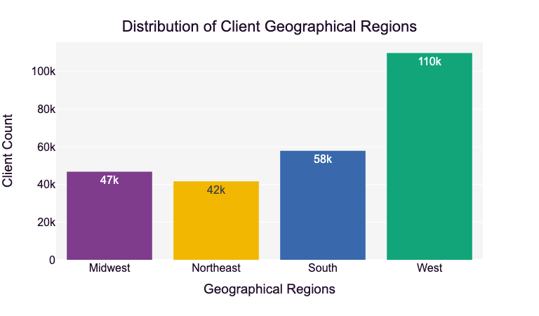
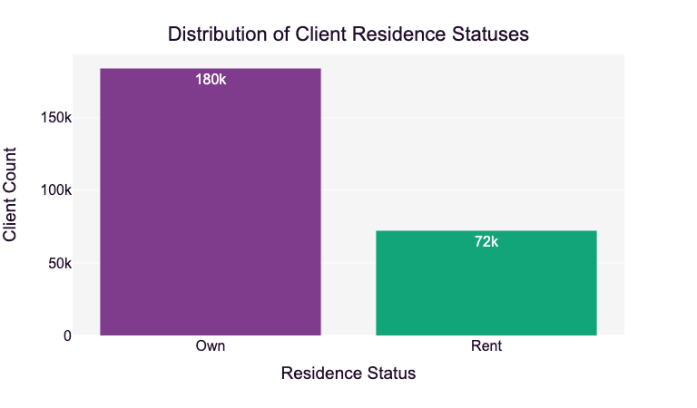

# Marketing Campaign Analysis - Part 1

## Background

### About the Business

Company A is a debt negotiation business. Clients have substantial debt and are unable to make their minimum monthly payments on the debt accounts. To help manage their debts, Company A creates a dedicated bank account where clients deposit regular monthly payments. Those accounts are then used to negotiate with creditors on behalf of the client to settle the outstanding debt. 

Company A's profits come from client-collected fees. When Company A successfully negotiates a settlement agreement these fees are charged to the client's account. The number of settlement agreements Company A can negotiate is proportional to the monthly deposited amount. 

### Analysis Purpose

Company A want to analyze the efficacy of a recent marketing campaign promoting the financial freedom clients can attain using their debt relief program. The campaign was aimed at both new and current clients with the intent of invigorating account deposits.  

The goal of this analysis is to **show marketing, sales and operations the success of the campaign**. Specifically, the analysis includes: 

- A quantitative assessment of whether the marketing campaign was successful.
- Recommended adjustments to the campaign strategy to improve performance.

### Defining Success
Given our available data, these are the possible success factors that will be considered:

- Increase in number of deposits during the campaign month
- Increase in total amount of deposits during the campaign month

### Data Overview

There are three datasets provided for the analysis; each is already cleaned and prepared:  

**client_data.csv: Fictional clients**

| Column Name | Description |
|---|---|
client_id|Unique client ID|
client_geographical_region|Client geo-location (U.S. Census definitions)|
client_residence_status|Client residence status|
client_age|Client age|


**deposit_data.csv: Client deposit behavior**

| Column Name | Description |
|---|---|
client_id|Unique client ID|
deposit_type|Scheduled vs. Actual deposit|
deposit_amount|Deposit amount|
deposit_cadence|Frequency of deposit (scheduled)|
deposit_date|Deposit date|


**calendar_data.csv: Calendar reference table**

| Column Name | Description |
|---|---|
|gregorian_date|Gregorian calendar date|
|month_name|Month relative to data set|

Notes: 

- Month 1 and 2 are pre-campaign
- Month 3 is the campaign
- Month 4 and 5 are post-campaign

Assumptions: 

- There is no seasonality in the results
- The campaign spend was distributed evenly across Month 3 (i.e., spend on the first day is the same as spend on the last day)


```python
# import packages
import numpy as np
import pandas as pd
import datetime
import plotly.express as px
import matplotlib.pyplot as plt
```

## Data Wrangling

For this first section, we're focusing on combining the relevant sample information into a single dataframe.  

The first thing to note is that there are *generally* two rows for each deposit: a scheduled deposit then the actual deposit. Each of the two rows has the same client_id, date, deposit amount, and cadence.

As such, we're going to create dummy variables for the two deposit types then group the deposits together so there is only one sample per deposit. This will create the following options for each deposit:

|Actual|Scheduled|Description|  
|---|---|---|
|True|True|A deposit is scheduled and completed|  
|True|False|A deposit is scheduled but not completed|  
|False|True|An unscheduled deposit is completed|

At the end of this section, each row will represent a single deposit. The final columns in the dataframe will be as follows:

|Column Name|Description|Value Type/Values|
|---|---|---|
|client_id| Unique client ID|Integer|
|deposit_amount| Amount of Deposit|Decimal |
|deposit_cadence| Frequency of Deposit|Categorical: Bi-Weekly, Extra, Monthly |
|deposit_date| Date of the deposit| datetime|
|actual_deposit| If the deposit was completed | Boolean: True/False|
|scheduled_deposit| If the deposit was scheduled | Boolean: True/False|
|month_name| Month relative to data set|Categorical: 1, 2, 3, 4, 5 |
|client_geographical_region|Client geo-location (U.S. Census definitions)|Categorical: Midwest, West, South, Northeast |
|client_residence_status|Client residence status |Categorical: Rent, Own|
|client_age| Client's age|Integer |
|age_group| Client's age in decades | Str: 30s, 40s, etc|


```python
# read in data
df_clients = pd.read_csv('data/client_data.csv')
df_deposits = pd.read_csv('data/deposit_data.csv')
df_calendar = pd.read_csv('data/calendar_data.csv')

# return basic details on dataframes
var_init_df_names = [df_clients, df_deposits, df_calendar]
for i in var_init_df_names:
    print(i.head())
    print('Total rows: ',i.shape[0])
    print('')
```

             client_id  ... client_age
    0  538839486596724  ...         91
    1  321708286091707  ...         83
    2  848531901757235  ...         84
    3  854405182328779  ...         83
    4  769102176031316  ...         85
    
    [5 rows x 4 columns]
    Total rows:  46347
    
             client_id       deposit_type  ...  deposit_cadence deposit_date
    0  446495122764671     Actual Deposit  ...          Monthly   2019-10-23
    1  446495122764671     Actual Deposit  ...          Monthly   2019-09-23
    2  446495122764671  Scheduled Deposit  ...          Monthly   2019-09-23
    3  446495122764671  Scheduled Deposit  ...          Monthly   2019-10-23
    4  446495122764671  Scheduled Deposit  ...          Monthly   2019-06-23
    
    [5 rows x 5 columns]
    Total rows:  480394
    
      gregorian_date month_name
    0     2019-06-01    Month 1
    1     2019-06-02    Month 1
    2     2019-06-03    Month 1
    3     2019-06-04    Month 1
    4     2019-06-05    Month 1
    Total rows:  153
    
             client_id  ... client_age
    0  538839486596724  ...         91
    1  321708286091707  ...         83
    2  848531901757235  ...         84
    3  854405182328779  ...         83
    4  769102176031316  ...         85
    
    [5 rows x 4 columns]
    Total rows:  46347
    
             client_id       deposit_type  ...  deposit_cadence deposit_date
    0  446495122764671     Actual Deposit  ...          Monthly   2019-10-23
    1  446495122764671     Actual Deposit  ...          Monthly   2019-09-23
    2  446495122764671  Scheduled Deposit  ...          Monthly   2019-09-23
    3  446495122764671  Scheduled Deposit  ...          Monthly   2019-10-23
    4  446495122764671  Scheduled Deposit  ...          Monthly   2019-06-23
    
    [5 rows x 5 columns]
    Total rows:  480394
    
      gregorian_date month_name
    0     2019-06-01    Month 1
    1     2019-06-02    Month 1
    2     2019-06-03    Month 1
    3     2019-06-04    Month 1
    4     2019-06-05    Month 1
    Total rows:  153
    


```python
# verify types of deposits
df_deposits.deposit_type.unique()
```


    array(['Actual Deposit', 'Scheduled Deposit'], dtype=object)


```python
# get dummies for deposit types
df = pd.get_dummies(data=df_deposits, prefix='', prefix_sep='', columns=['deposit_type'])
print(df.head())
print('Total rows: ',df.shape[0])
```

             client_id  deposit_amount  ... Actual Deposit Scheduled Deposit
    0  446495122764671           303.0  ...           True             False
    1  446495122764671           303.0  ...           True             False
    2  446495122764671           303.0  ...          False              True
    3  446495122764671           303.0  ...          False              True
    4  446495122764671           303.0  ...          False              True
    
    [5 rows x 6 columns]
    Total rows:  480394
             client_id  deposit_amount  ... Actual Deposit Scheduled Deposit
    0  446495122764671           303.0  ...           True             False
    1  446495122764671           303.0  ...           True             False
    2  446495122764671           303.0  ...          False              True
    3  446495122764671           303.0  ...          False              True
    4  446495122764671           303.0  ...          False              True
    
    [5 rows x 6 columns]
    Total rows:  480394


```python
# group scheduled/actual deposits for matching
df = df.groupby(['client_id', 'deposit_amount', 'deposit_cadence', 'deposit_date'], 
    as_index=False).agg({'Actual Deposit': 'max', 'Scheduled Deposit': 'max'})
print(df.head())
print('Total Rows: ',df.shape[0])
```

          client_id  deposit_amount  ... Actual Deposit Scheduled Deposit
    0  146046305811           247.0  ...          False              True
    1  146046305811           247.0  ...           True              True
    2  146046305811           247.0  ...           True              True
    3  146046305811           247.0  ...           True              True
    4  146046305811           247.0  ...           True              True
    
    [5 rows x 6 columns]
    Total Rows:  256143
          client_id  deposit_amount  ... Actual Deposit Scheduled Deposit
    0  146046305811           247.0  ...          False              True
    1  146046305811           247.0  ...           True              True
    2  146046305811           247.0  ...           True              True
    3  146046305811           247.0  ...           True              True
    4  146046305811           247.0  ...           True              True
    
    [5 rows x 6 columns]
    Total Rows:  256143


```python
# merge dataframes
df = pd.merge(df, df_calendar, left_on='deposit_date', right_on='gregorian_date', 
    how='inner', suffixes=('',''))
df = pd.merge(df, df_clients, on='client_id', how='inner', suffixes=('',''))

# clean columns
df['month_name'] = df['month_name'].str.extract(r'(\d+)').astype(int)
df = df.rename(columns={'month_name': 'month', 'Actual Deposit': 'actual_deposit', 
    'Scheduled Deposit': 'scheduled_deposit'})
df = df.drop(['gregorian_date'], axis=1)

df.head()
```


<div>
<style scoped>
    .dataframe tbody tr th:only-of-type {
        vertical-align: middle;
    }

    .dataframe tbody tr th {
        vertical-align: top;
    }

    .dataframe thead th {
        text-align: right;
    }
</style>
<table border="1" class="dataframe">
  <thead>
    <tr style="text-align: right;">
      <th></th>
      <th>client_id</th>
      <th>deposit_amount</th>
      <th>deposit_cadence</th>
      <th>deposit_date</th>
      <th>actual_deposit</th>
      <th>scheduled_deposit</th>
      <th>month</th>
      <th>client_geographical_region</th>
      <th>client_residence_status</th>
      <th>client_age</th>
    </tr>
  </thead>
  <tbody>
    <tr>
      <th>0</th>
      <td>146046305811</td>
      <td>247.0</td>
      <td>Biweekly</td>
      <td>2019-06-05</td>
      <td>False</td>
      <td>True</td>
      <td>1</td>
      <td>Midwest</td>
      <td>Rent</td>
      <td>42</td>
    </tr>
    <tr>
      <th>1</th>
      <td>146046305811</td>
      <td>247.0</td>
      <td>Biweekly</td>
      <td>2019-06-19</td>
      <td>True</td>
      <td>True</td>
      <td>1</td>
      <td>Midwest</td>
      <td>Rent</td>
      <td>42</td>
    </tr>
    <tr>
      <th>2</th>
      <td>146046305811</td>
      <td>247.0</td>
      <td>Biweekly</td>
      <td>2019-07-03</td>
      <td>True</td>
      <td>True</td>
      <td>2</td>
      <td>Midwest</td>
      <td>Rent</td>
      <td>42</td>
    </tr>
    <tr>
      <th>3</th>
      <td>146046305811</td>
      <td>247.0</td>
      <td>Biweekly</td>
      <td>2019-07-17</td>
      <td>True</td>
      <td>True</td>
      <td>2</td>
      <td>Midwest</td>
      <td>Rent</td>
      <td>42</td>
    </tr>
    <tr>
      <th>4</th>
      <td>146046305811</td>
      <td>247.0</td>
      <td>Biweekly</td>
      <td>2019-07-31</td>
      <td>True</td>
      <td>True</td>
      <td>2</td>
      <td>Midwest</td>
      <td>Rent</td>
      <td>42</td>
    </tr>
  </tbody>
</table>
</div>


```python
# establish function for grouping ages
def group_by_age(age):
    if age <30:
        return '20s'
    elif age <40:
        return '30s'
    elif age <50:
        return '40s'
    elif age <60:
        return '50s'
    elif age <70:
        return '60s'
    elif age <80:
        return '70s'
    elif age <90:
        return '80s'
    else:
        return '90s and above'

# apply function
df['age_group'] = df['client_age'].apply(group_by_age)
```


```python
# update categorical columns
df = df.astype({'deposit_cadence':'category', 'month':'category', 
    'client_geographical_region':'category', 'client_residence_status':'category'})

# update datetime column
df['deposit_date'] = pd.to_datetime(df['deposit_date'])

# download final csv for Tableau
df.to_csv('data/merged_data.csv')

df.info()
```

    <class 'pandas.core.frame.DataFrame'>
    RangeIndex: 256143 entries, 0 to 256142
    Data columns (total 11 columns):
     #   Column                      Non-Null Count   Dtype         
    ---  ------                      --------------   -----         
     0   client_id                   256143 non-null  int64         
     1   deposit_amount              256143 non-null  float64       
     2   deposit_cadence             256143 non-null  category      
     3   deposit_date                256143 non-null  datetime64[ns]
     4   actual_deposit              256143 non-null  bool          
     5   scheduled_deposit           256143 non-null  bool          
     6   month                       256143 non-null  category      
     7   client_geographical_region  256143 non-null  category      
     8   client_residence_status     256143 non-null  category      
     9   client_age                  256143 non-null  int64         
     10  age_group                   256143 non-null  object        
    dtypes: bool(2), category(4), datetime64[ns](1), float64(1), int64(2), object(1)
    memory usage: 11.2+ MB
    <class 'pandas.core.frame.DataFrame'>
    RangeIndex: 256143 entries, 0 to 256142
    Data columns (total 11 columns):
     #   Column                      Non-Null Count   Dtype         
    ---  ------                      --------------   -----         
     0   client_id                   256143 non-null  int64         
     1   deposit_amount              256143 non-null  float64       
     2   deposit_cadence             256143 non-null  category      
     3   deposit_date                256143 non-null  datetime64[ns]
     4   actual_deposit              256143 non-null  bool          
     5   scheduled_deposit           256143 non-null  bool          
     6   month                       256143 non-null  category      
     7   client_geographical_region  256143 non-null  category      
     8   client_residence_status     256143 non-null  category      
     9   client_age                  256143 non-null  int64         
     10  age_group                   256143 non-null  object        
    dtypes: bool(2), category(4), datetime64[ns](1), float64(1), int64(2), object(1)
    memory usage: 11.2+ MB


## Data Exploration

In this section we'll be reviewing the distributions for different columns to get an understanding of the provided data. 


```python
# overview of deposit amounts
df['deposit_amount'].describe()
```


    count    256143.000000
    mean        370.823427
    std         401.602436
    min           0.010000
    25%         200.000000
    50%         290.000000
    75%         454.000000
    max       30000.000000
    Name: deposit_amount, dtype: float64


```python
# remove outliers for histogram
df_sub1k_deposits = df[df['deposit_amount'] < 1000]

# histogram for deposit amounts < 1000
fig1 = px.histogram(df_sub1k_deposits, x='deposit_amount',
    color_discrete_sequence=px.colors.qualitative.Bold,
    text_auto='.2s', nbins=15)
fig1.update_layout(
    title={
        'text': 'Distribution of Deposits under 1k',
        'x':0.5,
        'xanchor': 'center',
        'yanchor': 'top'},
    xaxis_title='Deposit Amount',
    yaxis_title='Deposit Count',
    legend_title='Deposit Amount',
    font=dict(
        family='Arial',
        size=16,
        color='#210D2B'
    ),
    showlegend=False, 
    plot_bgcolor='#F5F5F5'
)
fig1.show()

```
<div style='display: inline-block; vertical-align: top; text-align: center;'>

</div>


```python
# overview of client age
df['client_age'].describe()
```


    count    256143.000000
    mean         52.125684
    std          13.794174
    min          21.000000
    25%          41.000000
    50%          52.000000
    75%          62.000000
    max         105.000000
    Name: client_age, dtype: float64


```python
# boxplot for client ages
fig2 = px.box(df, x='client_age',
    color_discrete_sequence=px.colors.qualitative.Bold)
fig2.update_layout(
    title={
        'text': 'Distribution of Client Ages',
        'x':0.5,
        'xanchor': 'center',
        'yanchor': 'top'},
    xaxis_title='Ages',
    font=dict(
        family='Arial',
        size=16,
        color='#210D2B'
    ),
    showlegend=False, 
    plot_bgcolor='#F5F5F5'
)
fig2.show()

```
<div style='display: inline-block; vertical-align: top; text-align: center;'>

</div>


```python
# histogram for client age groups < 1000
fig3 = px.histogram(df.sort_values(by=['age_group']), x='age_group',
color='age_group',
color_discrete_map={
                '20s': px.colors.qualitative.Bold[0],
                '30s': px.colors.qualitative.Bold[1],
                '40s': px.colors.qualitative.Bold[2],
                '50s': px.colors.qualitative.Bold[3],
                '60s': px.colors.qualitative.Bold[4],
                '70s': px.colors.qualitative.Bold[5],
                '80s': px.colors.qualitative.Bold[6],
                '90s and above': px.colors.qualitative.Bold[7],},
text_auto='.2s')
fig3.update_layout(
    title={
        'text': 'Distribution Client Age Groups',
        'x':0.5,
        'xanchor': 'center',
        'yanchor': 'top'},
    xaxis_title='Age Groups',
    yaxis_title='Client Count',
    legend_title='Age Groups',
    font=dict(
        family='Arial',
        size=16,
        color='#210D2B'
    ),
    showlegend=False, 
    plot_bgcolor='#F5F5F5'
)
fig3.show()
```
<div style='display: inline-block; vertical-align: top; text-align: center;'>

</div>


```python
# bar graph of deposit cadences
fig4 = px.histogram(df.sort_values(by=['deposit_cadence']), x='deposit_cadence',
    color='deposit_cadence',
    color_discrete_map={
                'Biweekly': px.colors.qualitative.Bold[0],
                'Extra': px.colors.qualitative.Bold[1],
                'Monthly': px.colors.qualitative.Bold[2]},
    text_auto='.2s')
fig4.update_layout(
    title={
        'text': 'Distribution of Deposit Frequencies',
        'x':0.5,
        'xanchor': 'center',
        'yanchor': 'top'},
    xaxis_title='Deposit Cadence',
    yaxis_title='Deposit Count',
    legend_title='Deposit Cadence',
    font=dict(
        family='Arial',
        size=16,
        color='#210D2B'
    ),
    showlegend=False, 
    plot_bgcolor='#F5F5F5'
)
fig4.show()
```
<div style='display: inline-block; vertical-align: top; text-align: center;'>

</div>


```python
# bar graph of geo regions
fig5 = px.histogram(df.sort_values(by=['client_geographical_region']), x='client_geographical_region',
    color='client_geographical_region',
    color_discrete_map={
                'Midwest': px.colors.qualitative.Bold[0],
                'West': px.colors.qualitative.Bold[1],
                'South': px.colors.qualitative.Bold[2],
                'Northeast': px.colors.qualitative.Bold[3]},
    text_auto='.2s')
fig5.update_layout(
    title={
        'text': 'Distribution of Client Geographical Regions',
        'x':0.5,
        'xanchor': 'center',
        'yanchor': 'top'},
    xaxis_title='Geographical Regions',
    yaxis_title='Client Count',
    legend_title='Geographical Regions',
    font=dict(
        family='Arial',
        size=16,
        color='#210D2B'
    ),
    showlegend=False, 
    plot_bgcolor='#F5F5F5'
)
fig5.show()
```
<div style='display: inline-block; vertical-align: top; text-align: center;'>

</div>


```python
# bar graph of residence types
fig6 = px.histogram(df.sort_values(by=['client_residence_status']), x='client_residence_status',
    color='client_residence_status',
    color_discrete_map={
                'Own': px.colors.qualitative.Bold[0],
                'Rent': px.colors.qualitative.Bold[1]},
    text_auto='.2s')
fig6.update_layout(
    title={
        'text': 'Distribution of Client Residence Statuses',
        'x':0.5,
        'xanchor': 'center',
        'yanchor': 'top'},
    xaxis_title='Residence Status',
    yaxis_title='Client Count',
    legend_title='Residence Status',
    font=dict(
        family='Arial',
        size=16,
        color='#210D2B'
    ),
    showlegend=False, 
    plot_bgcolor='#F5F5F5'
)
fig6.show()
```
<div style='display: inline-block; vertical-align: top; text-align: center;'>

</div>


## Initial Analysis

The analyses are primarily temporal line graphs broken out by month. As such, in each line there is a single data point for each month and there is a shaded purple zone that indicates the time period of the campaign (the third month).   

### Aggregated Number of Deposits per Month


```python
# get count of deposits each month
df_deposit_counts = df.groupby(['month'], as_index=False, observed=True).size()
df_deposit_counts
```


<div>
<style scoped>
    .dataframe tbody tr th:only-of-type {
        vertical-align: middle;
    }

    .dataframe tbody tr th {
        vertical-align: top;
    }

    .dataframe thead th {
        text-align: right;
    }
</style>
<table border="1" class="dataframe">
  <thead>
    <tr style="text-align: right;">
      <th></th>
      <th>month</th>
      <th>size</th>
    </tr>
  </thead>
  <tbody>
    <tr>
      <th>0</th>
      <td>1</td>
      <td>42257</td>
    </tr>
    <tr>
      <th>1</th>
      <td>2</td>
      <td>43503</td>
    </tr>
    <tr>
      <th>2</th>
      <td>3</td>
      <td>58674</td>
    </tr>
    <tr>
      <th>3</th>
      <td>4</td>
      <td>56397</td>
    </tr>
    <tr>
      <th>4</th>
      <td>5</td>
      <td>55312</td>
    </tr>
  </tbody>
</table>
</div>


```python
# line graph of deposit counts
fig7 = px.line(df_deposit_counts, x='month', y='size',
    color_discrete_sequence=px.colors.qualitative.Bold)
fig7.update_layout(
    title={
        'text': 'Deposits from June 2019 to Oct 2019',
        'x':0.5,
        'xanchor': 'center',
        'yanchor': 'top'},
    xaxis_title='Month',
    yaxis_title='Number of Deposits',
    font=dict(
        family='Arial',
        size=16,
        color='#210D2B'
    ),
    xaxis=dict(
        tickvals=[1,2,3,4,5],
        ticktext=['Jun', 'Jul', 'Aug', 'Sep', 'Oct']
    ), 
    plot_bgcolor='#F5F5F5'
)
fig7.add_vrect(x0=2.5, x1=3.5, line_width=0, fillcolor="purple", opacity=0.2)
fig7.show()
```
<div style='display: inline-block; vertical-align: top; text-align: center;'>

</div>


```python
# percent change in count, months 2-3, all deposits
var_mo2_counts = df_deposit_counts.loc[df_deposit_counts['month'] == 2, 'size'].values[0]
var_mo3_counts = df_deposit_counts.loc[df_deposit_counts['month'] == 3, 'size'].values[0]
var_pct_change_all_counts = round(var_mo2_counts/var_mo3_counts*100,2)
var_pct_change_all_counts
```


    74.14


### Total Amount of Deposits per Month


```python
# get sum deposits per month
df_deposit_amt = df.groupby(['month'], as_index=False, observed=True).agg({'deposit_amount': 'sum'})
df_deposit_amt
```


<div>
<style scoped>
    .dataframe tbody tr th:only-of-type {
        vertical-align: middle;
    }

    .dataframe tbody tr th {
        vertical-align: top;
    }

    .dataframe thead th {
        text-align: right;
    }
</style>
<table border="1" class="dataframe">
  <thead>
    <tr style="text-align: right;">
      <th></th>
      <th>month</th>
      <th>deposit_amount</th>
    </tr>
  </thead>
  <tbody>
    <tr>
      <th>0</th>
      <td>1</td>
      <td>16113037.42</td>
    </tr>
    <tr>
      <th>1</th>
      <td>2</td>
      <td>16465435.33</td>
    </tr>
    <tr>
      <th>2</th>
      <td>3</td>
      <td>21889292.74</td>
    </tr>
    <tr>
      <th>3</th>
      <td>4</td>
      <td>20388307.58</td>
    </tr>
    <tr>
      <th>4</th>
      <td>5</td>
      <td>20127752.00</td>
    </tr>
  </tbody>
</table>
</div>


```python
# line graph of summed deposit amounts
fig8 = px.line(df_deposit_amt, x='month', y='deposit_amount',
    color_discrete_sequence=px.colors.qualitative.Bold)
fig8.update_layout(
    title={
        'text': 'Summed Deposits from June 2019 to Oct 2019',
        'x':0.5,
        'xanchor': 'center',
        'yanchor': 'top'},
    xaxis_title='Month',
    yaxis_title='Summed Deposits ($mil)',
    font=dict(
        family='Arial',
        size=16,
        color='#210D2B'
    ),
    xaxis=dict(
        tickvals=[1,2,3,4,5],
        ticktext=['Jun', 'Jul', 'Aug', 'Sep', 'Oct']
    ), 
    plot_bgcolor='#F5F5F5'
)
fig8.add_vrect(x0=2.5, x1=3.5, line_width=0, fillcolor="purple", opacity=0.2)
fig8.show()
```
<div style='display: inline-block; vertical-align: top; text-align: center;'>

</div>


```python
# percent change in amount, months 2-3, all deposits
var_mo2_amt = df_deposit_amt.loc[df_deposit_amt['month'] == 2, 'deposit_amount'].values[0]
var_mo3_amt = df_deposit_amt.loc[df_deposit_amt['month'] == 3, 'deposit_amount'].values[0]
var_pct_change_all_amts = round(var_mo2_amt/var_mo3_amt*100,2)
var_pct_change_all_amts
```


    75.22


```python
# sum deposits <1k per month
df_sub1k_deposit_amt = df_sub1k_deposits.groupby(['month'], as_index=False, 
    observed=True).agg({'deposit_amount': 'sum'})
df_sub1k_deposit_amt
```


<div>
<style scoped>
    .dataframe tbody tr th:only-of-type {
        vertical-align: middle;
    }

    .dataframe tbody tr th {
        vertical-align: top;
    }

    .dataframe thead th {
        text-align: right;
    }
</style>
<table border="1" class="dataframe">
  <thead>
    <tr style="text-align: right;">
      <th></th>
      <th>month</th>
      <th>deposit_amount</th>
    </tr>
  </thead>
  <tbody>
    <tr>
      <th>0</th>
      <td>1</td>
      <td>13864331.54</td>
    </tr>
    <tr>
      <th>1</th>
      <td>2</td>
      <td>14129522.15</td>
    </tr>
    <tr>
      <th>2</th>
      <td>3</td>
      <td>18405323.07</td>
    </tr>
    <tr>
      <th>3</th>
      <td>4</td>
      <td>17554143.58</td>
    </tr>
    <tr>
      <th>4</th>
      <td>5</td>
      <td>17354664.81</td>
    </tr>
  </tbody>
</table>
</div>


```python
# line graph of summed deposit amounts < 1k
fig9 = px.line(df_sub1k_deposit_amt, x='month', y='deposit_amount',
    color_discrete_sequence=px.colors.qualitative.Bold)
fig9.update_layout(
    title={
        'text': 'Summed Deposits from June 2019 to Oct 2019<br><sup>Limited to Deposits under $1k</sup>',
        'x':0.5,
        'xanchor': 'center',
        'yanchor': 'top'},
    xaxis_title='Month',
    yaxis_title='Summed Deposits ($mil)',
    font=dict(
        family='Arial',
        size=16,
        color='#210D2B'
    ),
    xaxis=dict(
        tickvals=[1,2,3,4,5],
        ticktext=['Jun', 'Jul', 'Aug', 'Sep', 'Oct']
    ), 
    plot_bgcolor='#F5F5F5'
)
fig9.add_vrect(x0=2.5, x1=3.5, line_width=0, fillcolor="purple", opacity=0.2)
fig9.show()
```
<div style='display: inline-block; vertical-align: top; text-align: center;'>

</div>


```python
# percent change in amount, months 2-3, all deposits
var_mo2_sub1k_amt = df_sub1k_deposit_amt.loc[df_sub1k_deposit_amt['month'] == 2, 
    'deposit_amount'].values[0]
var_mo3_sub1k_amt = df_sub1k_deposit_amt.loc[df_sub1k_deposit_amt['month'] == 3, 
    'deposit_amount'].values[0]
var_pct_change_sub1k_amts = round(var_mo2_sub1k_amt/var_mo3_sub1k_amt*100,2)
var_pct_change_sub1k_amts
```


    76.77


### Impact of Client Geographical Region


```python
# monthly deposit count per geographical region
df_region_count = df.groupby(['month', 'client_geographical_region'], 
    as_index=False, observed=True).size()

# monthly deposit sum per geographical region
df_region_sum = df.groupby(['month', 'client_geographical_region'], 
    as_index=False, observed=True).agg({'deposit_amount': 'sum'})

print(df_region_count.head())
print('')
print(df_region_sum.head())
```

      month client_geographical_region   size
    0     1                    Midwest   7669
    1     1                  Northeast   6789
    2     1                      South   9822
    3     1                       West  17977
    4     2                    Midwest   7933
    
      month client_geographical_region  deposit_amount
    0     1                    Midwest      2985379.00
    1     1                  Northeast      2426698.10
    2     1                      South      3813617.93
    3     1                       West      6887342.39
    4     2                    Midwest      3015617.64
      month client_geographical_region   size
    0     1                    Midwest   7669
    1     1                  Northeast   6789
    2     1                      South   9822
    3     1                       West  17977
    4     2                    Midwest   7933
    
      month client_geographical_region  deposit_amount
    0     1                    Midwest      2985379.00
    1     1                  Northeast      2426698.10
    2     1                      South      3813617.93
    3     1                       West      6887342.39
    4     2                    Midwest      3015617.64


```python
# line graph for deposit count by region
fig10 = px.line(df_region_count, x='month', y='size',
    color_discrete_map={
                'Midwest': px.colors.qualitative.Bold[0],
                'West': px.colors.qualitative.Bold[1],
                'South': px.colors.qualitative.Bold[2],
                'Northeast': px.colors.qualitative.Bold[3]},
    color='client_geographical_region',
    line_dash='client_geographical_region')
fig10.update_layout(
    title={
        'text': 'Deposits from June 2019 to Oct 2019<br><sup>Divided by Geographic Region</sup>',
        'x':0.4,
        'xanchor': 'center',
        'yanchor': 'top'},
    xaxis_title='Month',
    yaxis_title='Number of Deposits',
    legend_title='Geographical Regions',
    font=dict(
        family='Arial',
        size=16,
        color='#210D2B'
        ),
    xaxis=dict(
        tickvals=[1,2,3,4,5],
        ticktext=['Jun', 'Jul', 'Aug', 'Sep', 'Oct']
        ), 
    plot_bgcolor='#F5F5F5' 

    )
fig10.add_vrect(x0=2.5, x1=3.5, line_width=0, fillcolor="purple", opacity=0.2)
fig10.show()
```
<div style='display: inline-block; vertical-align: top; text-align: center;'>

</div>


```python
# pivot df
df_region_count_pct = df_region_count.pivot(index='client_geographical_region', 
    columns='month', values='size').add_prefix('month_').reset_index().rename_axis(None, axis=1)

# calculate percent change
df_region_count_pct['pct_change'] = round((df_region_count_pct['month_3'] - \
    df_region_count_pct['month_2']) / df_region_count_pct['month_2'] * 100,2)

# select relevent columns
df_region_count_pct = df_region_count_pct.iloc[:,[0,-1]] \
    .sort_values(by='pct_change', ascending=False)

df_region_count_pct
```


<div>
<style scoped>
    .dataframe tbody tr th:only-of-type {
        vertical-align: middle;
    }

    .dataframe tbody tr th {
        vertical-align: top;
    }

    .dataframe thead th {
        text-align: right;
    }
</style>
<table border="1" class="dataframe">
  <thead>
    <tr style="text-align: right;">
      <th></th>
      <th>client_geographical_region</th>
      <th>pct_change</th>
    </tr>
  </thead>
  <tbody>
    <tr>
      <th>1</th>
      <td>Northeast</td>
      <td>37.56</td>
    </tr>
    <tr>
      <th>3</th>
      <td>West</td>
      <td>36.26</td>
    </tr>
    <tr>
      <th>0</th>
      <td>Midwest</td>
      <td>33.87</td>
    </tr>
    <tr>
      <th>2</th>
      <td>South</td>
      <td>31.23</td>
    </tr>
  </tbody>
</table>
</div>


```python
# line graph for deposit sum by region
fig11 = px.line(df_region_sum, x='month', y='deposit_amount',
    color_discrete_map={
                'Midwest': px.colors.qualitative.Bold[0],
                'West': px.colors.qualitative.Bold[1],
                'South': px.colors.qualitative.Bold[2],
                'Northeast': px.colors.qualitative.Bold[3]},
    color='client_geographical_region',
    line_dash='client_geographical_region')
fig11.update_layout(
    title={
        'text': 'Summed Deposits from June 2019 to Oct 2019<br><sup>Divided by Geographic Region</sup>',
        'x':0.4,
        'xanchor': 'center',
        'yanchor': 'top'},
    xaxis_title='Month',
    yaxis_title='Summed Deposits ($mil)',
    legend_title='Geographical Regions',
    font=dict(
        family='Arial',
        size=16,
        color='#210D2B'
        ),
    xaxis=dict(
        tickvals=[1,2,3,4,5],
        ticktext=['Jun', 'Jul', 'Aug', 'Sep', 'Oct']
        ), 
    plot_bgcolor='#F5F5F5' 

    )
fig11.add_vrect(x0=2.5, x1=3.5, line_width=0, fillcolor="purple", opacity=0.2)
fig11.show()
```
<div style='display: inline-block; vertical-align: top; text-align: center;'>

</div>


```python
# pivot df
df_region_sum_pct = df_region_sum.pivot(index='client_geographical_region', 
    columns='month', values='deposit_amount').add_prefix('month_').reset_index().rename_axis(None, axis=1)

# calculate percent change
df_region_sum_pct['pct_change'] = round((df_region_sum_pct['month_3'] - \
    df_region_sum_pct['month_2']) / df_region_sum_pct['month_2'] * 100,2)

# select relevent columns
df_region_sum_pct = df_region_sum_pct.iloc[:,[0,-1]] \
    .sort_values(by='pct_change', ascending=False)

df_region_sum_pct
```


<div>
<style scoped>
    .dataframe tbody tr th:only-of-type {
        vertical-align: middle;
    }

    .dataframe tbody tr th {
        vertical-align: top;
    }

    .dataframe thead th {
        text-align: right;
    }
</style>
<table border="1" class="dataframe">
  <thead>
    <tr style="text-align: right;">
      <th></th>
      <th>client_geographical_region</th>
      <th>pct_change</th>
    </tr>
  </thead>
  <tbody>
    <tr>
      <th>1</th>
      <td>Northeast</td>
      <td>35.73</td>
    </tr>
    <tr>
      <th>3</th>
      <td>West</td>
      <td>35.15</td>
    </tr>
    <tr>
      <th>0</th>
      <td>Midwest</td>
      <td>30.31</td>
    </tr>
    <tr>
      <th>2</th>
      <td>South</td>
      <td>29.09</td>
    </tr>
  </tbody>
</table>
</div>


### Impact of Client Residence Status


```python
# monthly deposit count per residence status
df_residence_count = df.groupby(['month', 'client_residence_status'], 
    as_index=False, observed=True).size()

# monthly deposit sum per residence status
df_residence_sum = df.groupby(['month', 'client_residence_status'], 
    as_index=False, observed=True).agg({'deposit_amount': 'sum'})

print(df_residence_count)
print('')
print(df_residence_sum)
```

      month client_residence_status   size
    0     1                     Own  30224
    1     1                    Rent  12033
    2     2                     Own  30953
    3     2                    Rent  12550
    4     3                     Own  42469
    5     3                    Rent  16205
    6     4                     Own  40517
    7     4                    Rent  15880
    8     5                     Own  39769
    9     5                    Rent  15543
    
      month client_residence_status  deposit_amount
    0     1                     Own     12292979.87
    1     1                    Rent      3820057.55
    2     2                     Own     12468493.20
    3     2                    Rent      3996942.13
    4     3                     Own     16789509.21
    5     3                    Rent      5099783.53
    6     4                     Own     15547196.13
    7     4                    Rent      4841111.45
    8     5                     Own     15372575.14
    9     5                    Rent      4755176.86
      month client_residence_status   size
    0     1                     Own  30224
    1     1                    Rent  12033
    2     2                     Own  30953
    3     2                    Rent  12550
    4     3                     Own  42469
    5     3                    Rent  16205
    6     4                     Own  40517
    7     4                    Rent  15880
    8     5                     Own  39769
    9     5                    Rent  15543
    
      month client_residence_status  deposit_amount
    0     1                     Own     12292979.87
    1     1                    Rent      3820057.55
    2     2                     Own     12468493.20
    3     2                    Rent      3996942.13
    4     3                     Own     16789509.21
    5     3                    Rent      5099783.53
    6     4                     Own     15547196.13
    7     4                    Rent      4841111.45
    8     5                     Own     15372575.14
    9     5                    Rent      4755176.86


```python
# line graph for deposit count by residence type
fig12 = px.line(df_residence_count, x='month', y='size',
    color_discrete_map={
                'Own': px.colors.qualitative.Bold[0],
                'Rent': px.colors.qualitative.Bold[1]},
    color='client_residence_status',
    line_dash='client_residence_status')
fig12.update_layout(
    title={
        'text': 'Deposits from June 2019 to Oct 2019<br><sup>Divided by Residence Status</sup>',
        'x':0.4,
        'xanchor': 'center',
        'yanchor': 'top'},
    xaxis_title='Month',
    yaxis_title='Number of Deposits',
    legend_title='Residence Statuses',
    font=dict(
        family='Arial',
        size=16,
        color='#210D2B'
        ),
    xaxis=dict(
        tickvals=[1,2,3,4,5],
        ticktext=['Jun', 'Jul', 'Aug', 'Sep', 'Oct']
        ), 
    plot_bgcolor='#F5F5F5' 

    )
fig12.add_vrect(x0=2.5, x1=3.5, line_width=0, fillcolor="purple", opacity=0.2)
fig12.show()
```
<div style='display: inline-block; vertical-align: top; text-align: center;'>

</div>


```python
# pivot df
df_residence_count_pct = df_residence_count.pivot(index='client_residence_status', 
    columns='month', values='size').add_prefix('month_').reset_index().rename_axis(None, axis=1)

# calculate percent change
df_residence_count_pct['pct_change'] = round((df_residence_count_pct['month_3'] - \
    df_residence_count_pct['month_2']) / df_residence_count_pct['month_2'] * 100,2)

# select relevent columns
df_residence_count_pct = df_residence_count_pct.iloc[:,[0,-1]] \
    .sort_values(by='pct_change', ascending=False)

df_residence_count_pct
```


<div>
<style scoped>
    .dataframe tbody tr th:only-of-type {
        vertical-align: middle;
    }

    .dataframe tbody tr th {
        vertical-align: top;
    }

    .dataframe thead th {
        text-align: right;
    }
</style>
<table border="1" class="dataframe">
  <thead>
    <tr style="text-align: right;">
      <th></th>
      <th>client_residence_status</th>
      <th>pct_change</th>
    </tr>
  </thead>
  <tbody>
    <tr>
      <th>0</th>
      <td>Own</td>
      <td>37.20</td>
    </tr>
    <tr>
      <th>1</th>
      <td>Rent</td>
      <td>29.12</td>
    </tr>
  </tbody>
</table>
</div>


```python
# line graph for deposit sum by residence type
fig13 = px.line(df_residence_sum, x='month', y='deposit_amount',
    color_discrete_map={
                'Own': px.colors.qualitative.Bold[0],
                'Rent': px.colors.qualitative.Bold[1]},
    color='client_residence_status',
    line_dash='client_residence_status')
fig13.update_layout(
    title={
        'text': 'Summed Deposits from June 2019 to Oct 2019<br><sup>Divided by Residence Status</sup>',
        'x':0.4,
        'xanchor': 'center',
        'yanchor': 'top'},
    xaxis_title='Month',
    yaxis_title='Summed Deposits ($mil)',
    legend_title='Residence Statuses',
    font=dict(
        family='Arial',
        size=16,
        color='#210D2B'
        ),
    xaxis=dict(
        tickvals=[1,2,3,4,5],
        ticktext=['Jun', 'Jul', 'Aug', 'Sep', 'Oct']
        ), 
    plot_bgcolor='#F5F5F5' 

    )
fig13.add_vrect(x0=2.5, x1=3.5, line_width=0, fillcolor="purple", opacity=0.2)
fig13.show()
```
<div style='display: inline-block; vertical-align: top; text-align: center;'>

</div>


```python
# pivot df
df_residence_sum_pct = df_residence_sum.pivot(index='client_residence_status', 
    columns='month', values='deposit_amount').add_prefix('month_').reset_index().rename_axis(None, axis=1)

# calculate percent change
df_residence_sum_pct['pct_change'] = round((df_residence_sum_pct['month_3'] - \
    df_residence_sum_pct['month_2']) / df_residence_sum_pct['month_2'] * 100,2)

# select relevent columns
df_residence_sum_pct = df_residence_sum_pct.iloc[:,[0,-1]] \
    .sort_values(by='pct_change', ascending=False)

df_residence_sum_pct
```


<div>
<style scoped>
    .dataframe tbody tr th:only-of-type {
        vertical-align: middle;
    }

    .dataframe tbody tr th {
        vertical-align: top;
    }

    .dataframe thead th {
        text-align: right;
    }
</style>
<table border="1" class="dataframe">
  <thead>
    <tr style="text-align: right;">
      <th></th>
      <th>client_residence_status</th>
      <th>pct_change</th>
    </tr>
  </thead>
  <tbody>
    <tr>
      <th>0</th>
      <td>Own</td>
      <td>34.66</td>
    </tr>
    <tr>
      <th>1</th>
      <td>Rent</td>
      <td>27.59</td>
    </tr>
  </tbody>
</table>
</div>


### Impact of Client Age


```python
# monthly deposit count per age group
df_age_count = df.groupby(['month', 'age_group'], 
    as_index=False, observed=True).size()

# monthly deposit sum per age group
df_age_sum = df.groupby(['month', 'age_group'], 
    as_index=False, observed=True).agg({'deposit_amount': 'sum'})

print(df_age_count.head())
print('')
print(df_age_sum.head())
```

      month age_group   size
    0     1       20s   1180
    1     1       30s   6826
    2     1       40s   9852
    3     1       50s  10914
    4     1       60s   8216
    
      month age_group  deposit_amount
    0     1       20s       294596.98
    1     1       30s      2181426.60
    2     1       40s      3562326.77
    3     1       50s      4224857.92
    4     1       60s      3391942.68
      month age_group   size
    0     1       20s   1180
    1     1       30s   6826
    2     1       40s   9852
    3     1       50s  10914
    4     1       60s   8216
    
      month age_group  deposit_amount
    0     1       20s       294596.98
    1     1       30s      2181426.60
    2     1       40s      3562326.77
    3     1       50s      4224857.92
    4     1       60s      3391942.68


```python
# line graph for deposit count by age group
fig14 = px.line(df_age_count, x='month', y='size',
    color_discrete_map={
                '20s': px.colors.qualitative.Bold[0],
                '30s': px.colors.qualitative.Bold[1],
                '40s': px.colors.qualitative.Bold[2],
                '50s': px.colors.qualitative.Bold[3],
                '60s': px.colors.qualitative.Bold[4],
                '70s': px.colors.qualitative.Bold[5],
                '80s': px.colors.qualitative.Bold[6],
                '90s and above': px.colors.qualitative.Bold[7],},
    color='age_group',
    line_dash='age_group')
fig14.update_layout(
    title={
        'text': 'Deposits from June 2019 to Oct 2019<br><sup>Divided by Age Group</sup>',
        'x':0.4,
        'xanchor': 'center',
        'yanchor': 'top'},
    xaxis_title='Month',
    yaxis_title='Number of Deposits',
    legend_title='Age Groups',
    font=dict(
        family='Arial',
        size=16,
        color='#210D2B'
        ),
    xaxis=dict(
        tickvals=[1,2,3,4,5],
        ticktext=['Jun', 'Jul', 'Aug', 'Sep', 'Oct']
        ), 
    plot_bgcolor='#F5F5F5' 

    )
fig14.add_vrect(x0=2.5, x1=3.5, line_width=0, fillcolor="purple", opacity=0.2)
fig14.show()
```
<div style='display: inline-block; vertical-align: top; text-align: center;'>

</div>


```python
# pivot df
df_age_count_pct = df_age_count.pivot(index='age_group', 
    columns='month', values='size').add_prefix('month_').reset_index().rename_axis(None, axis=1)

# calculate percent change
df_age_count_pct['pct_change'] = round((df_age_count_pct['month_3'] - \
    df_age_count_pct['month_2']) / df_age_count_pct['month_2'] * 100,2)

# select relevent columns
df_age_count_pct = df_age_count_pct.iloc[:,[0,-1]] \
    .sort_values(by='pct_change', ascending=False)

df_age_count_pct
```


<div>
<style scoped>
    .dataframe tbody tr th:only-of-type {
        vertical-align: middle;
    }

    .dataframe tbody tr th {
        vertical-align: top;
    }

    .dataframe thead th {
        text-align: right;
    }
</style>
<table border="1" class="dataframe">
  <thead>
    <tr style="text-align: right;">
      <th></th>
      <th>age_group</th>
      <th>pct_change</th>
    </tr>
  </thead>
  <tbody>
    <tr>
      <th>0</th>
      <td>20s</td>
      <td>78.35</td>
    </tr>
    <tr>
      <th>1</th>
      <td>30s</td>
      <td>43.19</td>
    </tr>
    <tr>
      <th>2</th>
      <td>40s</td>
      <td>36.40</td>
    </tr>
    <tr>
      <th>3</th>
      <td>50s</td>
      <td>32.47</td>
    </tr>
    <tr>
      <th>5</th>
      <td>70s</td>
      <td>28.65</td>
    </tr>
    <tr>
      <th>4</th>
      <td>60s</td>
      <td>27.68</td>
    </tr>
    <tr>
      <th>6</th>
      <td>80s</td>
      <td>21.28</td>
    </tr>
    <tr>
      <th>7</th>
      <td>90s and above</td>
      <td>17.12</td>
    </tr>
  </tbody>
</table>
</div>


```python
# line graph for deposit sum by age group
fig15 = px.line(df_age_sum, x='month', y='deposit_amount',
    color_discrete_map={
                '20s': px.colors.qualitative.Bold[0],
                '30s': px.colors.qualitative.Bold[1],
                '40s': px.colors.qualitative.Bold[2],
                '50s': px.colors.qualitative.Bold[3],
                '60s': px.colors.qualitative.Bold[4],
                '70s': px.colors.qualitative.Bold[5],
                '80s': px.colors.qualitative.Bold[6],
                '90s and above': px.colors.qualitative.Bold[7],},
    color='age_group',
    line_dash='age_group')
fig15.update_layout(
    title={
        'text': 'Summed Deposits from June 2019 to Oct 2019<br><sup>Divided by Age Group</sup>',
        'x':0.4,
        'xanchor': 'center',
        'yanchor': 'top'},
    xaxis_title='Month',
    yaxis_title='Summed Deposits ($mil)',
    legend_title='Age Groups',
    font=dict(
        family='Arial',
        size=16,
        color='#210D2B'
        ),
    xaxis=dict(
        tickvals=[1,2,3,4,5],
        ticktext=['Jun', 'Jul', 'Aug', 'Sep', 'Oct']
        ), 
    plot_bgcolor='#F5F5F5' 

    )
fig15.add_vrect(x0=2.5, x1=3.5, line_width=0, fillcolor="purple", opacity=0.2)
fig15.show()
```
<div style='display: inline-block; vertical-align: top; text-align: center;'>

</div>


```python
# pivot df
df_age_sum_pct = df_age_sum.pivot(index='age_group', 
    columns='month', values='deposit_amount').add_prefix('month_').reset_index().rename_axis(None, axis=1)

# calculate percent change
df_age_sum_pct['pct_change'] = round((df_age_sum_pct['month_3'] - \
    df_age_sum_pct['month_2']) / df_age_sum_pct['month_2'] * 100,2)

# select relevent columns
df_age_sum_pct = df_age_sum_pct.iloc[:,[0,-1]] \
    .sort_values(by='pct_change', ascending=False)

df_age_sum_pct
```


<div>
<style scoped>
    .dataframe tbody tr th:only-of-type {
        vertical-align: middle;
    }

    .dataframe tbody tr th {
        vertical-align: top;
    }

    .dataframe thead th {
        text-align: right;
    }
</style>
<table border="1" class="dataframe">
  <thead>
    <tr style="text-align: right;">
      <th></th>
      <th>age_group</th>
      <th>pct_change</th>
    </tr>
  </thead>
  <tbody>
    <tr>
      <th>0</th>
      <td>20s</td>
      <td>76.05</td>
    </tr>
    <tr>
      <th>1</th>
      <td>30s</td>
      <td>42.81</td>
    </tr>
    <tr>
      <th>2</th>
      <td>40s</td>
      <td>37.88</td>
    </tr>
    <tr>
      <th>3</th>
      <td>50s</td>
      <td>31.84</td>
    </tr>
    <tr>
      <th>4</th>
      <td>60s</td>
      <td>26.19</td>
    </tr>
    <tr>
      <th>5</th>
      <td>70s</td>
      <td>24.29</td>
    </tr>
    <tr>
      <th>6</th>
      <td>80s</td>
      <td>19.30</td>
    </tr>
    <tr>
      <th>7</th>
      <td>90s and above</td>
      <td>-12.31</td>
    </tr>
  </tbody>
</table>
</div>


## Results

The two success measures we focused on were:

- Increase in number of deposits during the campaign month
- Increase in total amount of deposits during the campaign month

In this section we'll consider how those goals measured up in the full client group as well as in client subsets.  

### Campaign Success on Full Client Set

In the full client set, there was a distinct increase in both the number of deposits and summed total of deposits between months two (pre-campaign) and three (campaign period). 

The following graph, <em>Deposits from June 2019 to October 2019</em>, demonstrates a 74.4% increase in the total number of deposits between months two and three, with month three being our campaign month (highlighted in purple).  

<div style='display: inline-block; vertical-align: top; text-align: center;'>

</div>

The increase in the number of deposits wasn't just clients making more deposits of smaller amount, though. The total dollar amount deposited increased by a similar percent between months two and three, as well.

The two following graphs, <em>Summed Deposits from June 2019 to October 2019</em> and <em>Summed Deposits from June 2019 to October 2019 (Limited to Deposits Under $1k)</em>, show 74.14% and 76.77% increases in the dollar amount of deposits between months two and three, respectively. 

<div style='width: 50%; display: inline-block; vertical-align: top; text-align: center;'>

</div><div style='width: 50%; display: inline-block; vertical-align: top; text-align: center;'>

</div>

The fact that each of the three measures had an increase of approximately 75% during the month of the campaign versus the preceeding months is a strong indicator that the campaign was a relative success. Of course, we will want to take into consideration the fact that these values again dropped after the campaign, though not to pre-campaign numbers. This will be discussed in the recommended next steps.

### Campaign Success on Client Subsets

This section reviews the campaign efficacy on the following client subsets:

- Client Geographical Regions (Northeast, Midwest, West, South)
- Client Residence Status (Rent, Own)
- Client Age Group (divided by decade)

As with the prior review, we'll consider efficacy in terms of an increase in the number of deposits and an increase in the total dollar amount of deposits between months two and three. 

It is important to note, though, that intersectionality is not taken into account within these subsets. As such, it is possible for confounding to occur. This is discussed in recommended next steps. 

#### Success Measured by Deposit Count

When reviewing the increase in deposit counts between months two and three, every sub-group in every category had an increase. However, not all increases are created equal. These are the spreads for each of the subsets:

- Client Geographical Region: 6.33% (Low: 31.23%; High: 37.56%) 
- Client Residence Status: 8.08% (Low: 29.12%; High: 37.20% ) 
- Client Age Group: 61.23% (Low: 17.12%; High: 78.35%) 

<div style='width: 33%; display: inline-block; vertical-align: top; text-align: center;'>


|Region| % Change in Count | 
|---|---|
| Northeast | 37.56% | 
| West | 36.26% | 
|Midwest | 33.87% | 
| South | 31.23% | 

</div>
<div style='width: 33%; display: inline-block; vertical-align: top; text-align: center;'>


|Residence Status| % Change in Count | 
|---|---|
| Own | 37.20% | 
| Rent | 29.12% | 

</div>
<div style='width: 33%; display: inline-block; vertical-align: top; text-align: center;'>


|Age Group| % Change in Count | 
|---|---|
| 20s | 78.35% | 
| 30s | 43.19% | 
|40s | 36.40% | 
| 50s | 32.47% | 
| 60s | 27.68% | 
| 70s | 28.65% | 
| 80s |21.28% | 
| 90s + | 17.12% | 

</div>

From this, we can posit that individual regions and residence statuses did not play a huge role in the campaign success. However, client age had a direct impact on the overall success. Specifically, there's a strong trend that younger clients were more likely to act on the campaign than older clients.  

#### Success Measured by Dollar Amount of Deposits

For increases in the dollar amount deposited between months two and three, though, there was not an increase in every sub-group. Rather, while clients in their 90's and above did increase the number of deposits, there was actually a decrease in the total dollar amount deposited. The rest of the subsets did show an increase, though, with the following ranges represented:

- Client Geographical Region: 6.64% (Low: 29.09%; High: 35.73%) 
- Client Residence Status: 7.07% (Low: 27.59%; High: 34.66% ) 
- Client Age Group<sup>*</sup>: 56.75% (Low: 19.30%; High: 76.05%) 

<sup>*</sup>Removing clients in their 90's and above, who showed a decrease in dollar amounts deposited

<div style='width: 33%; display: inline-block; vertical-align: top; text-align: center;'>


|Region| % Change in Amount |
|---|---|
| Northeast | 35.73% |
| West | 35.15% |
|Midwest | 30.31% |
| South | 29.09% |

</div>
<div style='width: 33%; display: inline-block; vertical-align: top; text-align: center;'>


|Residence Status| % Change in Amount |
|---|---|
| Own | 34.66% |
| Rent | 27.59% |

</div>
<div style='width: 33%; display: inline-block; vertical-align: top; text-align: center;'>


|Age Group| % Change in Amount |
|---|---|
| 20s | 76.05% |
| 30s | 42.81% |
|40s | 37.88% |
| 50s | 31.84% |
| 60s | 26.19% |
| 70s | 24.29% |
| 80s | 19.30% |
| 90s + | -12.31% |

</div>

The trends shown in the number of deposits continued in the total dollar amount deposited per sub-group: geographical region and residence status had minimal imact on the campaign efficacy, while client ages had a clear impact on campaign success; younger age groups had better response to the campaign than older age groups.  

### Recommended Next Steps

While the campaign was generally successfull, there are three things mentioned in this analysis which require further review:

- Decreases in both deposit counts and dollar amounts deposited after the campaign
- The impact of intersectionality on campaign success
- Identifying priority clients to get the best ROI on campaign expenses

#### Post-Campaign Decreases

While the campaign showed initial success we would want to consider long-term effects on clients. An influx in payments over a single month is beneficial to both Company A and clients, but if the accounts quickly revert to historical payment schedules then the overall benefit of the campaign is reduced. As such, we would want to identify a plan to ensure ongoing success.

#### Impact of Intersectionality

In general, it seems as if client age groups played the bigged role in the overall success of the campaign. However, some deeper analysis to identify the combined subsets of customers on whom the campaign was most effective would benefit the final point of identifying priority clients. 

#### Priority Clients

Finally, after deeper analysis to hone in on the combined client subsets who had the best camapgin reponse, we can refine the campaign to further focus on those client groups. This would help improve the overall efficacy of the campaign. Alogn with that, we could also get a better understanding of the worst-performing subsets to design a plan to invigorate those groups using their own specialized campaigns.   
